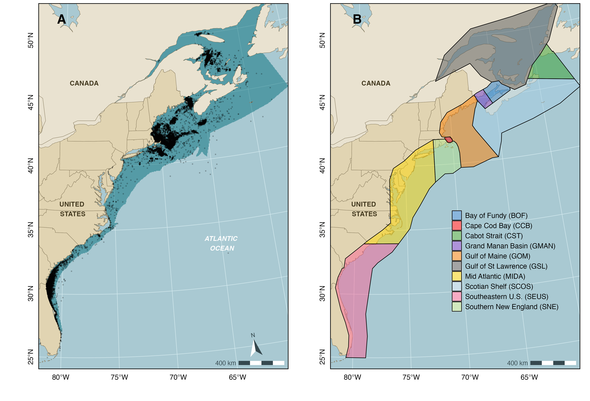
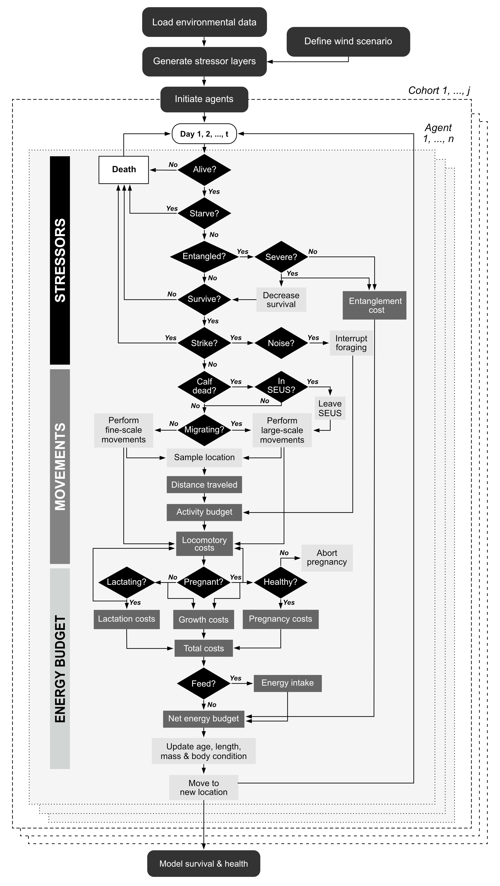
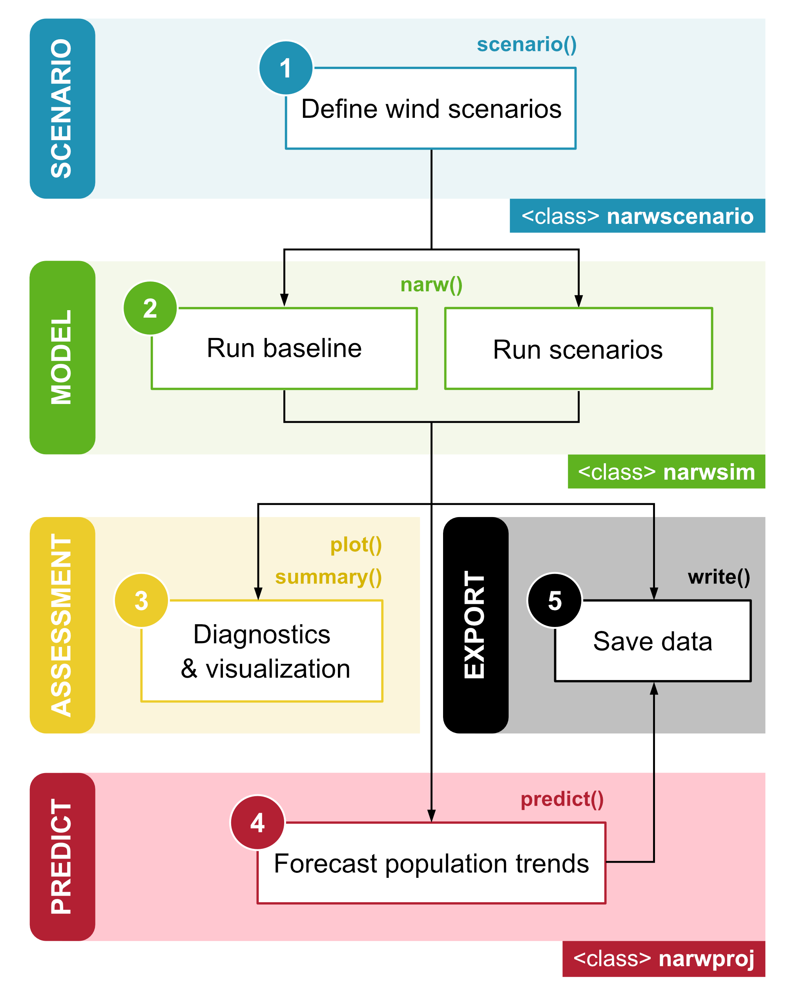

```{r setup, include = FALSE}
knitr::opts_knit$set(root.dir = rprojroot::find_rstudio_root_file())
knitr::opts_chunk$set(
  collapse = TRUE,
  comment = "#>")
```

```{r, echo = FALSE}
downloadthis::download_link(
  link = "https://raw.githubusercontent.com/offshore-wind/narwind/98ad9169dd09dfad682d0dc4f5c32c9ad02aeef1/vignettes/pdf/1_Overview%20and%20workflow.pdf",
  button_label = "Download PDF",
  button_type = "primary",
  has_icon = TRUE,
  icon = "fa fa-file-pdf",
  self_contained = FALSE
)
```

## Preamble

This tutorial provides a brief description of the bioenergetic model. For full technical details, please refer to the accompanying project report.

## Model structure

The North Atlantic right whale bioenergetic model implemented in `narwind` combines an agent-based model with a stochastic population model (Figure 1.1). The former is used to understand how anthropogenic stressors affect NARW survival and health, as defined by a system of bioenergetic equations that consider NARW behavior and energy budgets. The insights gained from that model are then used to parameterize a stochastic population model that yields predictions of future NARW abundance.


### Agent-based model

In the agent-based model, whale movements are simulated in two-dimensional space within the extent of the NARW geographic range in U.S. and Canadian waters, i.e., a 878,225 km^2^ area between Florida and the Gulf of St Lawrence, out to the edge of the continental shelf and out to the ca. 35 m isobath northward and southward of Cape Hatteras (35.25°N, 75.54°W), respectively. This spatial domain includes all grid cell locations where NARW density is predicted to exceed 0.001 whales per 25 km^2^ in any month of the year and was chosen to ensure that simulated movements are constrained to reasonable depth bounds whilst maximizing coverage of NARW sightings reported in the NARWC database (i.e., 97.4% of sightings logged as of June 6, 2022). The domain is further divided into ten regional polygons encompassing critical NARW habitats (e.g., calving grounds, foraging grounds, migratory corridors) (Figure 1.2). Note that the model excludes a vertical (depth) component, as knowledge of NARW diving physiology and behavior remains too limited to parameterize a three-dimensional model with dive-by-dive resolution.



The agent-based model proceeds in discrete daily time steps. Simulations are run for a total of 15 months (i.e., 457 days), starting on the first day of October. This includes an initial ‘burn-in’ period of 3 months (i.e., 92 days – also called a ‘warm-up’), which allows agents to converge to a stable equilibrium state that adequately reflects the ecological processes being modeled. Data from the burn-in phase are discarded from the analysis to reduce initialization bias and minimize potential errors in the estimation of model parameters. Model outputs therefore cover a full calendar year (i.e., duration of 12 months) spanning the period January 1 through to December 31.

The model is run using the `narw()` function in `narwind` (see the relevant tutorial). When `narw()` is called, several things happen behind the scenes (Figure 1.3):

-   First, the model is initialized by loading required data, generating stressor surfaces from offshore wind scenario parameters, and setting up virtual agents.

-   Next, the simulation engine of the agent-based model loops over days and agents, keeping track of the condition of individuals (black diamonds) at each time step. Simulations are performed separately for each of six population cohorts (i.e., juvenile males, juvenile females, adult males, adult females (resting), adult females (pregnant), and adult females (lactating, with dependent calves). These run in parallel on different cores to maximize efficiency.

-   Upon completion of the simulation, the survival and health of agents in each cohort at the end of the 15 months are modeled as a function of their initial body condition (i.e., relative fat mass). The resulting relationships underpin inference of future population trends obtained under the stochastic population model.



Note that, contrary to other agent-based models of marine mammals, simulated NARW movements are not conditional on individual health, prey availability, or human disturbance. Agents also do not build an inherent memory map of where favorable plankton patches are located, nor do patches deplete after being visited by agents. Every day, agents assimilate energy from ingested food and allocate available energy to fulfil their daily metabolic requirements. If assimilated energy exceeds the combined costs of resting metabolism, activity, somatic growth, and reproduction (i.e., gestation or lactation), then the surplus energy is stored as blubber, thereby increasing the individual’s body condition (or relative fat mass). By contrast, if assimilated energy is insufficient to cover these combined costs, then existing reserve tissue is catabolized to meet the animal’s daily needs. In these circumstances, an agent’s body condition will be lower on the next day. Fluctuations in individual health therefore stem from both variability in prey availability along an agent’s movement path and individual energy demands. We assume that poor health compromises reproductive attempts, such that females may abort their pregnancy if their reserve mass falls to critically low levels and is insufficient to sustain their daily energetic costs and avoid the onset of starvation. Similarly, lactation is interrupted following the death of a calf.

The agent-based model is spatially explicit and is informed by several raster surfaces that relate to key model parameters, such as prey density or noise levels. These are updated either daily or monthly in the simulation, depending on available data (Table 1).

**Table 1**. Spatial layers used to define the simulation landscape.

| Raster              | Resolution         | Derived from                                                                                                                                        | Source(s) / Data providers                                                            |
|------------------|------------------|--------------------|------------------|
| Strike risk         | Monthly (10x10 km) | Records of sea-going vessel movements as captured by Automatic Identification Systems (AIS)                                                         | NOAA Fisheries (U.S. waters), MERIDIAN (Canadian waters)                              |
| Entanglement risk   | Monthly (5x5 km)   | Risk estimates from NOAA's Decision Support Tool, complemented by a comparative analysis of fishing effort within northern U.S. vs. Canadian waters | NOAA Fisheries (U.S. waters), North Atlantic Fisheries Organization (Canadian waters) |
| Pile-driving noise  | Daily (5x5 km)     | Simple acoustic propagation model, which assumes that transmission loss is dependent on log-range and frequency-specific absorption                 | \-                                                                                    |
| Prey concentration  | Monthly (10x10 km) | Predictions from a depth-integrated species distribution model for *Calanus finmarchicus*, *Calanus hyperboreus*, and *Calanus glacialis*           | Fisheries and Oceans Canada                                                           |
| Right whale density | Monthly (5x5 km)   | Predictions from density surface models developed from shipboard and aerial survey data                                                             | Duke University (MGEL)                                                                |

The package contains all the surfaces required to undertake an assessment of NARW abundance under three hypothetical offshore wind development scenarios (see Tutorial 2), as well as under baseline conditions in the absence of wind farm construction activities. `narwind` allows users to develop their own custom scenarios of offshore wind development using an interactive Shiny app (see Tutorial 2). However, model parameters (including the raster surfaces listed in Table 1) are not readily accessible to package users. Any updates to these require changes to the source code, which is reserved for developers.

### Population model

In `narwind`, predictions of future NARW abundance are derived from a stochastic population model (see Tutorial 5). This is another simulation model, wherein the survival, reproductive status, and health of individuals in the current (i.e., real) NARW population are tracked through time. The model operates in yearly increments and is not spatially explicit. Births and deaths are simulated probabilistically based on estimates of survival and fecundity obtained from the agent-based model.

## Analytical workflow

In `narwind`, a typical modeling workflow consists of five steps (Figure 1.4), all of which are covered in detail in subsequent tutorials. These include:

1.  Defining the parameters of one or more target offshore wind scenario(s) using the `scenario()` function.

2.  Running agent-based simulations using the `narw()` function, including in the absence of wind farm development activities (i.e., baseline conditions).

3.  Inspecting, visualizing, and summarizing model outputs using the `summary()`, `plot()`, and `print()` methods.

4.  Estimating uncertainty associated with health and survival functions, to be propagated into population projections [optional] using the `augment()` function.

5.  Forecasting right whale abundance using the `predict()` method.

Optionally, the `export()` method can be used to save data on disk for further analysis/reporting.

::: {style="width:550px"}

:::
