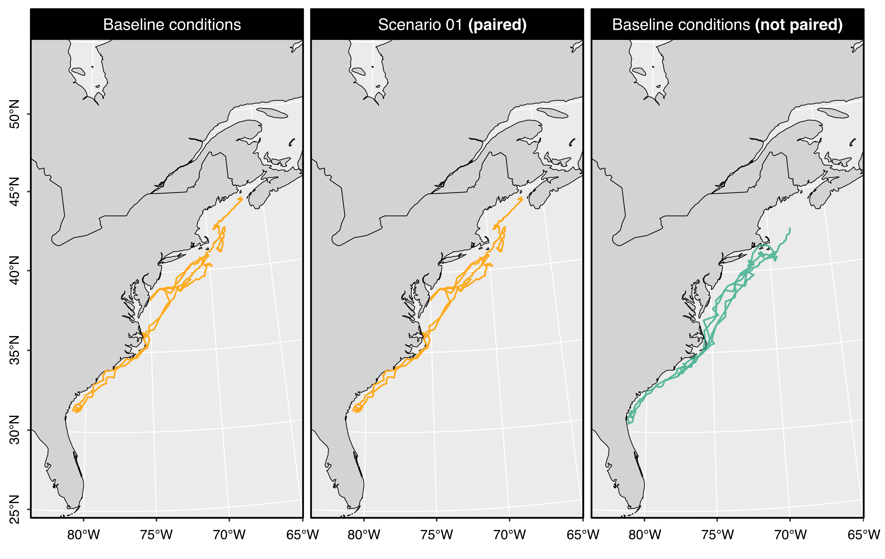

```{r setup, include = FALSE}
knitr::opts_knit$set(root.dir = rprojroot::find_rstudio_root_file())
knitr::opts_chunk$set(
  collapse = TRUE,
  comment = "#>")
```

```{r, echo = FALSE}
downloadthis::download_link(
  link = "https://raw.githubusercontent.com/offshore-wind/narwind/99df759f85ce0f5d495a864a5d35bc854b5951d9/vignettes/pdf/getting_started.pdf",
  button_label = "Download PDF",
  button_type = "primary",
  has_icon = TRUE,
  icon = "fa fa-file-pdf",
  self_contained = FALSE
)
```

## Preamble

This tutorial demonstrates how to run the agent-based model within the `narwind` R package.

## Running the model

Once the package is loaded (see Tutorial 1), the agent-based model is run by calling the `narw()` function. By default, the model will simulate n = 1,000 individuals for each of the six population cohorts considered, under baseline conditions reflecting the absence of any wind farm development activity. This default model can be run by typing:

```{r basemodel, eval = FALSE}
model_base <- narw()
```

Several arguments can be passed to `narw()`, as listed below. We detail each of them in subsequent sections.

| Argument        | Default value          | Description                                                                                                                                                                                                                                                                                                                                                        |
|-------------------|-------------------|----------------------------------|
| `nsim`          | `1000`                 | Positive integer. Number of simulated animals.                                                                                                                                                                                                                                                                                                                     |
| `scenario`      | `NULL`                 | An optional scenario object, as returned by the `scenario()` function.                                                                                                                                                                                                                                                                                             |
| `pair`          | `NULL`                 | Simulation outputs, as returned by a previous run of the `narw()` function, to which the current simulation must be matched. With the exception of wind farm parameters, simulation conditions between paired runs are identical; pairing is therefore useful to enable comparative assessments of population projections under competing offshore wind scenarios. |
| `label`         | `""`                   | Character. Text label assigned to the simulation object; used for plotting.                                                                                                                                                                                                                                                                                        |
| `piling.hrs`    | `4`                    | Numeric. Length of time (hours) during which whales cease foraging following a response to pile-driving noise exposure.                                                                                                                                                                                                                                            |
| `n.cores`       | `NULL`                 | Positive integer. Number of CPU cores to use for parallel processing. The default value of `NULL` detects the processor configuration and runs computations on the maximum allowable number of available cores.                                                                                                                                                    |
| `cease.nursing` | `c(FALSE, piling.hrs)` | Vector of length two. The first element indicates whether (`TRUE`) or not (`FALSE`) nursing behavior is interrupted in response to pile-driving noise exposure. The second indicates how long the nursing cessation period lasts.                                                                                                                                  |

### Number of agents

The `nsim` argument controls the number of simulated animals and is set to `1,000` by default. Users can override this setting, however we recommend against using values of `nsim < 1000` as this is the minimum number of virtual agents required for reliable inference. Below is an example of a smaller simulation for 10 individuals only.

```{r basemodel10, eval = FALSE}
model_base_10 <- narw(nsim = 10)
```

### Offshore wind scenario

The `scenario` argument is used to run models that entail wind farm construction activities. Scenario objects must be created using the `scenario()` function described in the previous tutorial. The code snippet below shows how to run the agent-based model for the first of the three preset scenarios that come with the package:

```{r run_model01, eval = FALSE}
model_scenario_01 <- narw(nsim = 1000, scenario = scenario_01)
```

To save model results, remember that calls to `narw()` must be assigned to an R object using the assignment `<-` operator. In the examples above, we stored model outputs in custom objects arbitrarily named `model_scenario_01`.

### Pairing simulations

It is important to note that the agent-based model is stochastic, such that successive runs of the model will return different results (e.g., different simulated movement tracks for each agent). However, meaningful comparisons of population projections between contrasting offshore wind scenario bundles are only possible if simulated conditions are maintained between model runs. The `pair` argument was designed to enable this using random seed matching, which allows users to supply an existing model object – as returned by `narw()` – that can act as a "template" for the current simulation (Figure 3.1).

For instance, the code below performs three separate runs of the model (with n = 50 simulated agents). The first and second lines are repeat simulations under baseline conditions. The third involves piling taking place at three sites, as defined in the `scenario_01` object (see previous Tutorial). The third run is paired with the baseline scenario stored in `model_baseline`, using the `pair` argument. With the exception of wind farm-related parameters, all simulated conditions are therefore identical between `model_baseline` and `model_scenario_01`.

```{r model_match, eval = FALSE}
model_baseline <- narw(nsim = 50)
model_baseline_repeat <- narw(nsim = 50)
model_scenario_01 <- narw(nsim = 50, 
                          scenario = scenario_01, 
                          pair = model_scenario_01)
```

::: {style="width:850px"}

:::

### Labeling

Simulation outputs can be labelled using the `label` argument. This is useful for plotting purposes, for example when comparing population trends obtained from different wind scenarios.

```{r, eval = FALSE}
model_example <- narw(nsim = 1000, label = "Example")
```

### Duration of piling

We assume that a single pile in installed per day, and that the maximum duration of piling operations is 4 hours. Importantly, this defines the duration length of time during which whales will cease foraging following a response to pile-driving noise exposure. To increase/decrease this duration, set the `piling.hrs` argument to a different value. For instance:

```{r, eval = FALSE}
model_example <- narw(nsim = 1000, piling.hrs = 8)
```

### Parallel computing

The agent-based model is set up to run simulations in parallel on multiple cores. To maximize efficiency, the package will maximize the number of cores used relative to availability (i.e., 6 cores will be used on machines with more than 6 cores available, 2 cores fewer than the maximum available elsewhere). The number of cores used for parallel computations can be changed via the `n.cores` argument. Setting `n.cores` to a lower value will reduce impact on overall machine performance but will increase the duration of model runs.

```{r, eval = FALSE}
model_example <- narw(nsim = 1000, n.cores = 2)
```

> **Note 3.1:** A simulation of 1000 agents using 6 cores takes approx. 1 hr 37 mins on a 2021 iMac (M1) running Mac OS Sonoma 14.1.2. However, run times may vary between operating systems. In general, `narwind` performs more efficiently on machines running Mac OS or Linux. We recommend the use of these operating systems wherever possible.

### Nursing cessation (not recommended)

Although there is mounting evidence that disturbance from noise-generating activities may heighten the risk of mother–calf pair separation and limit the time available for suckling in other baleen whale species, it is not currently known whether pile driving (or other noise sources such as seismic surveys) can cause complete interruption of nursing. In the absence of information, we assume that nursing is unaffected by noise. However, we built the model with the option to override this default. The `cease.nursing` argument can be used to impose an arbitrary nursing cessation period. However, we advise against doing so until a dedicated dose-response function that characterizes changes in nursing behavior can be estimated.

The code below shows the correct syntax for this argument, which contains two elements:

-   The first element indicates whether (`TRUE`) or not (`FALSE`) nursing behavior is interrupted in response to pile-driving noise exposure.

-   The second indicates how long the nursing cessation period lasts.

Those elements need to be specified using the `c()` function (which stands for 'concatenate').

```{r, eval = FALSE}
model_example <- narw(nsim = 1000, cease.nursing = c(TRUE, 5))
```

## Disturbance scenarios

The code below runs models for each of the three preset offshore wind scenarios, as well a baseline scenario. Each run is labelled appropriately.

```{r threescenarios, eval = FALSE}
model_base <- narw(1000, label  = "Baseline")
model_01 <- narw(1000, scenario = scenario_01, pair = model_base, label = "Scenario 01")
model_02 <- narw(1000, scenario = scenario_02, pair = model_base, label = "Scenario 02")
model_03 <- narw(1000, scenario = scenario_03, pair = model_base, label = "Scenario 03")
```
