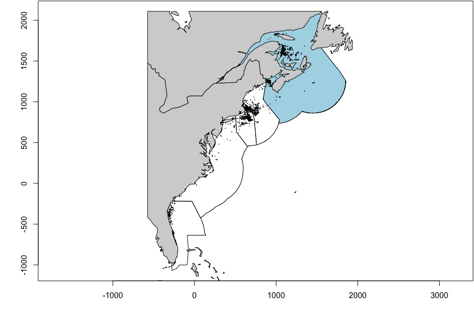
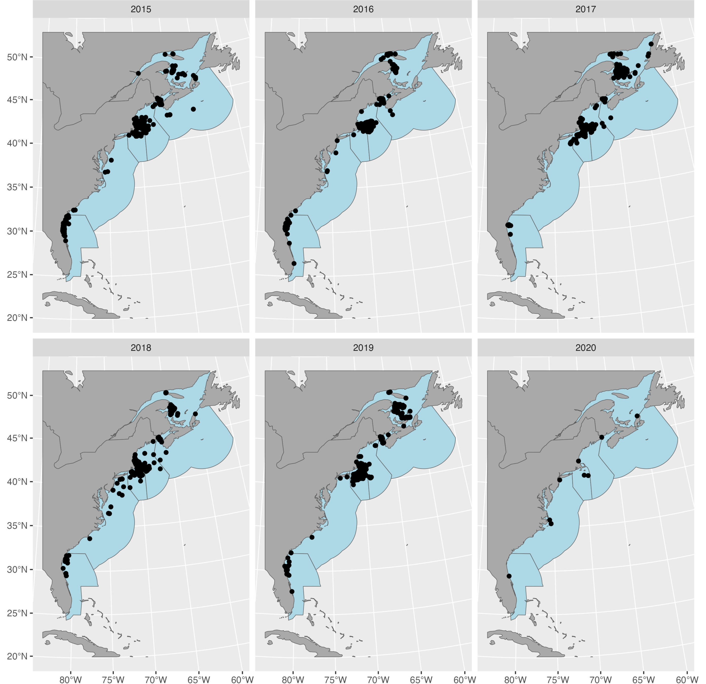
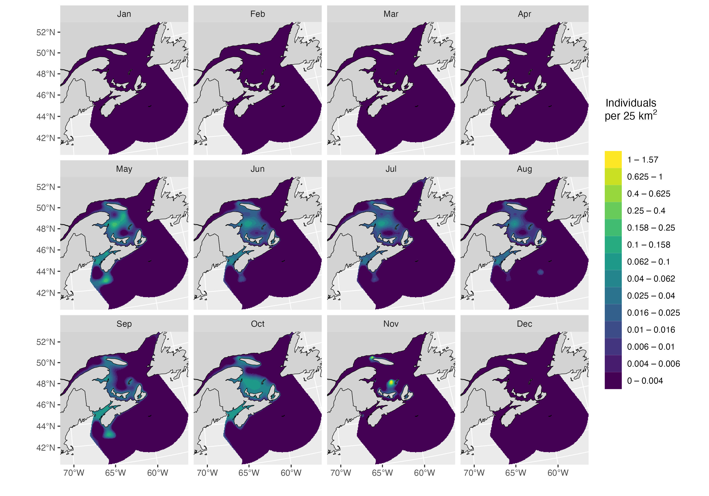
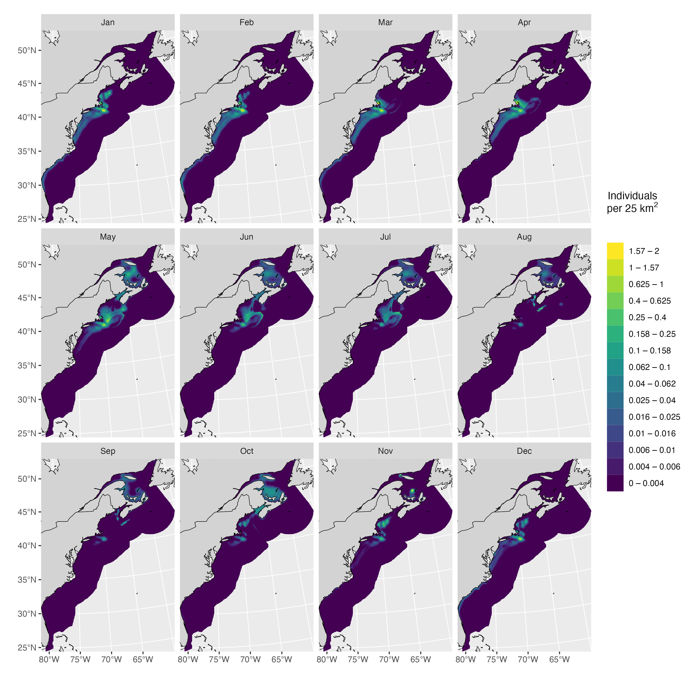

## Preamble

This document describes the approach taken to model spatial patterns in North Atlantic Right Whale (*Eubalaena glacialis*, hereafter NARW) density within Canadian waters (Gulf of St Lawrence and Scotian Shelf).

## Set up

Before we start, let's load all the required libraries, set some global options, and define some custom functions required for the analysis.

```{r load, include=FALSE}
# pkg <- "/Volumes/GoogleDrive/My Drive/Documents/git/narwind"
# load(file.path(pkg,"data/vignettes/narwdens.RData"))
```

```{r setup, include = FALSE}
knitr::opts_knit$set(root.dir = rprojroot::find_rstudio_root_file())
knitr::opts_chunk$set(
  collapse = TRUE,
  comment = "#>")
```

```{r start, echo=TRUE, results='hide', message=FALSE, eval=TRUE}
options(tibble.width = Inf)
options(pillar.neg = FALSE)
options(pillar.subtle = TRUE)
options(pillar.sigfig = 5)
options(dplyr.summarise.inform = FALSE)

# Load required libraries
library(tidyverse)
library(ggplot2)
library(fields)
library(targets)
library(raster)
library(mgcv)
library(mgcViz)
library(sf)
library(nngeo)
library(sp)
library(patchwork)
library(ggspatial)
library(rgeos)
library(terra)
library(glue)
library(furrr)
library(future)

# For soap film smooth
# Scripts can be downloaded from https://github.com/dill/soap_checker
source(file.path(pkg, "inst/autocrunch.R"))
source(file.path(pkg, "inst/soap_check.R"))

# Bespoke package functions
source(file.path(pkg, "R/utils.R"))
```

## Spatial data

First, we bring in the right whale density surfaces produced by Duke University; these only cover U.S. waters, and part of the Scotian Shelf in the summer months. The latest version (v12) of the model from which these surfaces are derived is available at 5 km resolution; however, for consistency with previous versions, model predictions are expressed as numbers of individuals per 100 km^2^ (i.e., 10 x 10 km resolution). We therefore re-scale the monthly rasters to calculate density per 25 km^2^ (i.e., 5 x 5 km resolution).

> **Note:** More information on habitat-based marine mammal density models for the U.S. Atlantic is available at <https://seamap.env.duke.edu/models/Duke/EC/>

```{r dens, eval=FALSE}
d <- list.files(path = file.path(pkg, "data/densitymaps"), pattern = "density_month")
d <- purrr::map(.x = d, .f = ~{
  d.file <- raster::raster(file.path(pkg, "data/densitymaps", .x))
  d.file <- raster::projectRaster(from = d.file, crs = narw_crs())
  25*d.file/100
  }) |> purrr::set_names(nm = month.abb)
```

Next, we import sightings data from the North Atlantic Right Whale Consortium (<https://www.narwc.org/>), and apply two filters:

-   A geographic filter that discards a small number of sightings reported in the Gulf of Mexico and throughout the northeast Atlantic
-   A temporal filter that only retains sightings made after the species' documented distribution shift to the Gulf of St Lawrence in 2015 [@Meyer-Gutbrod2022; @Simard2019].

We only retain sightings from animals identified in the NARW Consortium catalog and remove potential duplicates by reducing multiple sightings of the same individual in any given month x year to one data point (using averaged coordinates). This helps avoid unrealistically high densities in some grid cells.

```{r sightingsimport, include = FALSE, eval=FALSE}
sightings <- readr::read_csv(file.path(pkg, "data/sightings/narwc_sightings.csv"), col_types = cols()) 
```

```{r sightingsfilter, eval=FALSE}
narwc <- sightings |>
  janitor::clean_names() |>
  dplyr::filter((longitude > -85 & longitude < -44) & (latitude < 58 | latitude > 55)) |>
  dplyr::filter(sighting_year >= 2015 & sighting_year < 2021) |>
  dplyr::filter(!is.na(eg_no)) |> 
  dplyr::mutate(sighting_time = stringr::str_pad(sighting_time, 4, pad = "0")) |> 
  dplyr::mutate(sighting_time = paste0(stringr::str_sub(sighting_time, 1, 2), ":", stringr::str_sub(sighting_time, 3, 4))) |> 
  dplyr::mutate(date = lubridate::dmy_hm(paste0(sighting_day, "/", sighting_month,"/", sighting_year, " ", sighting_time))) |> 
  dplyr::mutate(month = factor(month.abb[sighting_month], levels = month.abb))

# Add projected coordinates
narwc <- add_xy(narwc)

# Split the data by eg_no, year, and month
narwc <- narwc |> 
  dplyr::mutate(comb = glue::glue("{sighting_year}-{sighting_month}-{eg_no}"))

narwc.thin <- split(x = narwc, f = factor(narwc$comb)) |> 
  purrr::map(.f = ~colMeans(.x[,c("x", "y")])) |> 
  do.call(what = rbind) |> 
  data.frame() |> 
  tibble::rownames_to_column(var = "comb")

narwc <- narwc |> dplyr::select(-longitude, -latitude, -x, -y) |> 
  dplyr::left_join(y = narwc.thin, by = "comb") |> 
  dplyr::distinct(comb, .keep_all = TRUE) |> 
  tibble::as_tibble() |> 
  dplyr::select(-comb)

# Convert to <SpatialPointsDataFrame>
narwc.sp <- sp::SpatialPointsDataFrame(
  coords = narwc[, c("x", "y")],
  data = narwc,
  proj4string = narw_crs())
```

Lastly, we generate/bring in all the shapefiles needed for plotting and modelling.

```{r shapefiles, eval=FALSE}
targets::tar_config_set(store = file.path(pkg, "_targets/"))

# Import regions and project to CRS
regions <- targets::tar_read(regions_eez) |> 
  sp::spTransform(CRSobj = narw_crs())

world <- targets::tar_read(world)

# Using a zero-width buffer cleans up topology problems
rgeos::gIsValid(regions)
regions <- rgeos::gBuffer(regions, byid = TRUE, width = 0)
rgeos::gIsValid(regions)

# Import shapefile for Canada and project to CRS
canada <- raster::shapefile(file.path(pkg, "data/regions/NARW_Canada_eez.shp")) |> 
  sp::spTransform(CRSobj = narw_crs())

# Import and crop coastline shapefile
world <- rnaturalearth::ne_countries(scale = "medium")
world_sf <- rnaturalearth::ne_countries(scale = "medium", returnclass = "sf")

world <- suppressWarnings(sp::spTransform(world, CRSobj = narw_crs()) |> 
    raster::crop(y = raster::extent(c(-574.1478, 1934.829, -1534.189, 2109.078))))

world_sf <- sf::st_transform(world_sf, crs = narw_crs()) |> 
  sf::st_crop(xmin = -574.1478, xmax = 1934.829, ymin = -1534.189, ymax = 2109.078)

# Extent of Canadian waters
canada_ocean <- raster::erase(canada, world)

# Identify sightings made in Canadian waters
narwc <- add_country(narwc)
narwc.sp@data <- narwc

# Remove sightings on land and sightings outside the study area
onland <- rgeos::gIntersects(world, narwc.sp, byid = T) |> rowSums()
outarea <- rgeos::gIntersects(regions, narwc.sp, byid = T) |> rowSums()
narwc.sp <- narwc.sp[-unique(c(which(outarea==0), which(onland==1))),]
narwc <- narwc[-unique(c(which(outarea==0), which(onland==1))),]
```

To model sighting density, we will need to include the areas of each grid cell as offsets. These will equal 25 km^2^ (the native resolution of the density raster) across most of the study region, but will vary where the raster meets the shore. We use a custom function called `toRaster_area`to convert the raster grid to spatial polygons, clip the resulting shapefile with the coastline, perform the area calculations, and convert back to raster form.

```{r cellareas, eval=FALSE}
# Create raster with the same resolution and origin as the 
# existing density surfaces
d.res <- raster::res(d$Jan)
r.canada <- toRaster_area(canada_ocean)
```

We can plot the sightings both as a whole and by year. The regions shown are those defined under PCoMS - however, note that they have been extended out to the edge of the U.S./Canadian EEZs to be consistent with the original extent of the Duke University density surface products.

```{r quickmaps, eval = FALSE}
par(mar = c(4, 4, 0.1, 0.1))
# Whole range
plot(regions, axes = TRUE)
plot(canada, col = "lightblue", add = TRUE)
plot(world, col = "lightgrey", add = TRUE)
plot(narwc.sp, add = T, pch = 16, cex = 0.25)

par(mfrow = c(1,1))
```



```{r gg, eval = FALSE}
# Plot sightings per year
ggplot2::ggplot() +
  ggplot2::geom_sf(data = sf::st_as_sf(regions), fill = "lightblue") +
  ggplot2::geom_sf(data = sf::st_as_sf(world), fill = "darkgrey") +
  ggplot2::geom_sf(data = sf::st_as_sf(narwc.sp)) +
  ggplot2::facet_wrap(~factor(sighting_year)) +
  ggplot2::theme(plot.margin = margin(t = 0, r = 0, b = 0, l = 0))
```



## Sighting density

Next, we calculate the monthly density of sightings per 5 x 5 km grid cell, averaged across years. Note that there are **no effort** data available here, so this assumes that the entire study area has been adequately/homogeneously covered, and that each sighting is of a single individual, not of a group of whales. We can tally sightings to identify the months of the year when NARW are present in Canadian waters, and we set `n = 10` as the minimum number of sightings needed for modelling. In the table below, `count` represents the number of sightings for each month in the initial dataset, and `n` the number of sightings after setting any values \> 10 to zero.

```{r monthlydens, eval=FALSE}
# Minimum number of sightings required to model density
min.n <- 10

# Number of sightings per month
df.count <- month.abb |> 
  purrr::set_names() |> 
  purrr::map(.f = ~{narwc |> dplyr::filter(region == "Canada", month == .x) |> 
      nrow()}) |> 
  tibble::enframe() |> 
  dplyr::rename(month = name) |> 
  dplyr::mutate(count = unlist(value)) |> dplyr::select(-value) |> 
  dplyr::mutate(month = factor(month, levels = month.abb)) |> 
  dplyr::mutate(n = ifelse(count >= min.n, count, 0))

knitr::kable(df.count, format = "simple")

# Define months when NARW are in Canada
narw.months <- df.count[df.count$n >0,]$month

# Split the data by month
narwc.bymonth <- narwc |> 
  dplyr::filter(region == "Canada") |> 
  (function(x) split(x = x, f = x$month))()

# Calculate sightings density in each raster grid cell in each month
r.dens <- purrr::map(
  .x = month.abb,
  .f = ~ {
    if (df.count[df.count$month == .x, ]$n == 0) {
      r.canada$d
    } else {
      uyr <- unique(narwc.bymonth[[.x]]$sighting_year)
      r.out <- lapply(
        X = uyr,
        FUN = function(yr) {
          rpts <- narwc.bymonth[[.x]] |> dplyr::filter(sighting_year == yr)
          rpts <- split(rpts, f = factor(lubridate::day(rpts$date)))

          rpts.count <- lapply(X = rpts, FUN = function(y) {
            rr <- sp::SpatialPointsDataFrame(
              coords = y[, c("x", "y")],
              data = y, proj4string = narw_crs())
            pointcount(r.canada$d, rr, canada_ocean)})
          raster::stack(rpts.count)
        }
      ) |> purrr::set_names(nm = uyr)
      raster::stack(r.out)
    }}) |> purrr::set_names(nm = month.abb)

# Average density across years for each month
r.narw <- purrr::map(.x = r.dens, .f = ~raster::calc(x = .x, fun = mean))

# Convert to <data.frame>
df.narw <- purrr::map(.x = r.narw, .f = ~{as.data.frame(.x, xy = TRUE) |> dplyr::filter(!is.na(layer))})
df.narw <- purrr::map(.x = month.abb, .f = ~dplyr::mutate(.data = df.narw[[.x]], month = .x)) |> 
  do.call(what = rbind) |> 
  dplyr::rename(count = layer)
```

## Grid cell areas

Before we start building the model, we ought to check that cell areas are correct, and add them to the working `data.frame`.

```{r areacheck, eval=FALSE}
# Add areas to 
r.poly <- raster::rasterToPolygons(r.canada)
df.narw$area <- rep(r.poly$area, length(month.abb))
df.narw <- add_country(df.narw)

r.overlap <- sp::over(r.poly, world, returnList = TRUE)
r.overlap <- purrr::map_dbl(.x = r.overlap, .f = ~nrow(.x))
r.overlap <- r.overlap == 1
r.poly.overlap <- r.poly[r.overlap,]
```

```{r plotcheck}
plot(canada_ocean, main = "Raster cells intersecting the coast")
plot(world, col = "grey", add = TRUE)
plot(r.poly.overlap, col = "orange", border = "orange", add = TRUE)

plot(canada_ocean, main = "Cell areas (sq. km)")
plot(world, col = "grey", add = TRUE)
plot(r.canada$area, col = pals::viridis(100), add = TRUE)
```

## Generalized additive model

### Input data

Next, we generate the dataset needed for fitting a generalized additive model (GAM) to NARW densities. We only know the locations where animals have been observed, so we assume that animals were absent in grid cells where sightings were not reported. We subset those grid cells to avoid having an unrealistically large number of absences, which could complicate model fitting. This is achieved by creating a regular grid over the study region and taking the grid nodes as absence points. We use exclusion buffers around sightings to prevent absence points from being too close to areas with positive density values. An example plot for the month of July is presented below.

```{r absences, eval=FALSE}
# Create regular grid across the study area to avoid over-inflation of zeroes
# Use the buffer function from <terra> to ensure no points fall on land
# including islands

# Set random seed
set.seed(20221017)

r.grid <- sp::makegrid(canada_ocean, cellsize = 75) |>
  sp::SpatialPoints(proj4string = narw_crs())
r.grid <- rgeos::gIntersection(spgeom1 = terra::buffer(canada_ocean, width = -10), spgeom2 = r.grid)
row.names(r.grid) <- as.character(seq_len(length(r.grid)))

plot(r.grid, col = "blue", cex = 0.5)
plot(world, add = T, col = "grey")

# par(mfrow = c(2,4))

df.month <- month.abb |> 
  purrr::set_names() |> 
  purrr::map(.f = ~{
    
    if(df.count[df.count$month == .x,]$n == 0){
      
      NULL
      
    } else {
      
      # Extract the data for the month of interest
      df.filter <- df.narw |> dplyr::filter(month == .x)
      
      # Extract cells that have sightings
      pos <- df.filter |> dplyr::filter(count > 0)
      
      # Convert locations into a polygon and buffer the resulting area
      pos.poly <- raster::rasterFromXYZ(pos[, c("x", "y", "count")], 
                                        res = d.res, crs = narw_crs()) |>
        raster::rasterToPolygons()
    
      r.dissolve <- rgeos::gUnionCascaded(pos.poly)
      r.buffer <- rgeos::gBuffer(r.dissolve, width = 25)
      
      # Remove grid points that fall within the buffer
      r.grid.zero <- rgeos::gDifference(r.grid, r.buffer)
      
      if(.x == "Jul"){
      plot(canada_ocean, main = .x)
      plot(pos.poly, add = T,)
      plot(r.buffer, border = "orange", add = T)
      plot(r.grid.zero, col = "blue", add = T, pch = 16, cex = 0.5)
      plot(canada_ocean, add = TRUE, border = "black")
      }
      
      df.zero <- data.frame(sp::coordinates(r.grid.zero), 
                            count = 0, 
                            month = factor(unique(pos$month)),
                            area = raster::extract(r.canada$area, r.grid.zero))
      
      df.zero <- add_country(df.zero)
      df.out <- rbind(pos, df.zero)
      row.names(df.out) <- NULL
      df.out
    }
  }) 

par(mfrow = c(1,1))
```

### Soap film

Conventional bivariate spatial splines may perform poorly in the presence of physical boundary features such as islands and peninsulae, so we opt for a soap film smooth instead, as soap films are appropriate for finite area smoothing over complex spatial domains such as the U.S./ Canada coastline. The number of internal knots is a compromise between model resolution and computing speed. Note that we need to set constraints on boundary conditions to indicate that NARW density tends to zero towards those boundaries that align with the shore. However, other boundaries fall in water, where density may be positive (e.g., the U.S. / Canada border). This is a tricky situation, as mixed boundaries such as these are not allowed in soap film smooths (David Miller, personal communication). As a workaround, we run two models: one with constraints placed on island boundaries only (but not the mainland), and another with constraints on all boundaries. We combine resulting predictions to get the final output.

```{r soapfilm, eval=FALSE}
# Code taken from Fall et al. (2018) 
# https://doi.org/10.1371/journal.pone.0205921.s001

# Generate grid
ocean.xy <- broom::tidy(canada_ocean) |> dplyr:: rename(x = long, y = lat)
N <- floor(abs(raster::extent(canada_ocean)[2]-raster::extent(canada_ocean)[1])/85)
gx <- seq(raster::extent(canada_ocean)[1], raster::extent(canada_ocean)[2], length.out = N)
gy <- seq(raster::extent(canada_ocean)[3], raster::extent(canada_ocean)[4], length.out = N)
gp <- expand.grid(gx, gy)
names(gp) <- c("x","y")

# The study area has a highly complex coastline, including many
# small islands, which throw errors if included.
# We only retain the seven largest coastline features (incl. the mainland)
b.ind <- c(1:7)

# The GAM needs the border coordinates as a list of lists,
# where each list describes one border segment or island:
oceancoords <- ocean.xy %>% dplyr::select(x,y,piece)
borderlist <- split(oceancoords, oceancoords$piece)
border.narw <- lapply(borderlist, `[`, c(1,2))
borderlist <- borderlist[b.ind]
border.narw <- border.narw[b.ind]
border.narw <- lapply(seq_along(b.ind), function(n) as.list.data.frame(border.narw[[n]]))

# The inSide can be used to select knots that are inside the border
knots <- gp[with(gp, mgcv::inSide(bnd = border.narw, x, y)), ]

# This passes the soap_check test but still returns an error
# during model fitting – we remove any remaining offending  knots manually.

text.counter <- NULL
while (is.null(text.counter)){

  test.dsm <- evaluate::evaluate(
  "mgcv::gam(formula = count ~ offset(log(area)) + 
  s(x, y, bs = \"so\", xt = list(bnd = border.narw)), 
  data = df.month[[\"Jul\"]][1:20,], 
  method = \"REML\",
  family = tw(link = \"log\"),
  knots = knots)")

  if(stringr::str_sub(as.character(test.dsm[[2]]), 1, 21) == "Error in crunch.knots"){

    error.msg <- as.character(test.dsm[[2]])
    error.msg <- stringr::str_sub(error.msg, gregexpr(":", error.msg)[[1]][1] + 2, nchar(error.msg))
    problem.knot <- readr::parse_number(error.msg)
    knots <- knots[-problem.knot, ]
    cat("Removing knot:", problem.knot, "\n")
    text.counter <- NULL

  } else {

    text.counter <- "Stop"
  }

} # End while loop

# Set constraint on boundary conditions around all islands but not the coastline
border.islands <- border.narw
border.islands[2:length(border.islands)] <- 
  purrr::map(.x = border.islands[2:length(border.islands)], .f = ~{
    tmp <- .x
    tmp$f = rep(0, times = length(tmp$x))
    tmp
  })

# Set constraint on boundary conditions around all boundaries
border.narw <- purrr::map(.x = border.narw, .f = ~{
  tmp <- .x
  tmp$f = rep(0, times = length(tmp$x))
  tmp
})
```

```{r}
# Check results
# soap_check(bnd = border.narw, knots = knots)
```

### Model fitting

We fit a hierarchical GAM, coded as model `GI` from @Pedersen2019. This model allows for a shared spatial trend, from which deviations may occur in each month. It is therefore set up with a single common smoother, plus monthly smoothers with differing levels of wiggliness. We use the `bam` engine and fast REML to speed up calculations.

```{r hgam, eval=FALSE}
model.hgam.isl <- "count ~ offset(log(area)) + s(x, y, m = 2, bs = \"so\", xt = list(bnd = border.islands)) + s(x, y, by = month, bs = \"so\", m = 1, xt = list(bnd = border.islands)) + s(month, bs = \"re\", k = length(narw.months))"

model.hgam.main <- "count ~ offset(log(area)) + s(x, y, m = 2, bs = \"so\", xt = list(bnd = border.narw)) + s(x, y, by = month, bs = \"so\", m = 1, xt = list(bnd = border.narw)) + s(month, bs = \"re\", k = length(narw.months))"

df.hgam <- do.call(rbind, df.month) |> dplyr::mutate(month = factor(month))

hgam.isl <- mgcv::bam(
  formula = as.formula(model.hgam.isl),
  data = df.hgam,
  method = "fREML",
  discrete = TRUE,
  family = tw(),
  knots = knots)

hgam.main <- mgcv::bam(
  formula = as.formula(model.hgam.main),
  data = df.hgam,
  method = "fREML",
  discrete = TRUE,
  family = tw(),
  knots = knots)
```

```{r modsummary}
summary(hgam.isl)
summary(hgam.main)

# Residual checks
# par(mfrow = c(2,2))
# my_gam.check(hgam.isl)
# abline(a = 0, b = 1, col = "orange")
# par(mfrow = c(1,1))
# 
# par(mfrow = c(2,2))
# my_gam.check(hgam.main)
# abline(a = 0, b = 1, col = "orange")
# par(mfrow = c(1,1))
```

### Model predictions

Lastly, we generate predictions from all models and visualize them. We merge them with existing density surfaces from Duke University in order to get maps that span the entire right whale range. Note that the code is set up to retain the values from the original Duke surfaces in areas where rasters overlap, as these are built from dedicated survey data and are therefore more reliable.

```{r predictions, eval=FALSE}
preds.df.hgam <- month.abb |> 
  purrr::set_names() |> 
  purrr::map(.f = ~{
    as.data.frame(r.canada, xy = TRUE, na.rm = TRUE) |> 
    dplyr::select(-d) |> 
    dplyr::mutate(month = factor(.x))
  }) |> do.call(what = rbind) |> 
  dplyr::mutate(Nhat_isl = 0, Nhat_main = 0, Nhat = 0)

# Generate model predictions
future::plan(multisession)

preds.hgam.isl <-
  furrr::future_map(.x = narw.months, 
             .f = ~predict_hgam(object = hgam.isl, 
                    newdata = preds.df.hgam[preds.df.hgam$month %in% .x,], 
                                type = "response")) |> do.call(what = c)

preds.hgam.main <-
  furrr::future_map(.x = narw.months, 
             .f = ~predict_hgam(object = hgam.main, 
                    newdata = preds.df.hgam[preds.df.hgam$month %in% .x,], 
                                type = "response")) |> do.call(what = c)

preds.df.hgam$Nhat_isl[preds.df.hgam$month %in% narw.months] <- preds.hgam.isl
preds.df.hgam$Nhat_main[preds.df.hgam$month %in% narw.months] <- preds.hgam.main

preds.df.hgam <- preds.df.hgam |> 
  dplyr::rowwise() |> 
  dplyr::mutate(Nhat = min(Nhat_isl, Nhat_main)) |> 
  dplyr::ungroup()

# Create prediction rasters
# Canada only
d.narwc.canada <- month.abb |>
  purrr::set_names() |> 
  purrr::map(.f = ~{
    preds.list.hgam <- split(preds.df.hgam, f = factor(preds.df.hgam$month))
    raster::rasterFromXYZ(preds.list.hgam[[.x]][, c("x", "y", "Nhat")], res = d.res)})

# Whole range
d.narwc <- month.abb |>
  purrr::set_names() |> 
  purrr::map(.f = ~{
    preds.list.hgam <- split(preds.df.hgam, f = factor(preds.df.hgam$month))
    pdata.r <- raster::rasterFromXYZ(preds.list.hgam[[.x]][, c("x", "y", "Nhat")], res = d.res)
    x <- list(d[[.x]], pdata.r$Nhat)
    do.call(raster::merge, x)}) |> 
  purrr::map(.f = ~{tmp <- .x; names(tmp) <- "Nhat"; tmp})

# Merge with density surface
d.narwc.df <- month.abb |>
  purrr::set_names() |> 
  purrr::map(.f = ~{
  raster::as.data.frame(d.narwc[[.x]], xy = TRUE, na.rm = TRUE) |> 
    dplyr::mutate(month = factor(.x))
}) |> do.call(what = rbind)
```

Model predictions are shown below, first for Canadian waters, then for the entire species' range.

```{r predplot, eval=FALSE}
plot_preds(preds.df.hgam, plot.sightings = FALSE)
plot_preds(d.narwc.df, plot.sightings = FALSE)
```





To make sure that NARW don't wander out into deep, offshore waters during the simulation, we can crop the rasters above a minimum density threshold. The resulting spatial support is shown below.

```{r simsupport, fig.height = 8, fig.width = 6}
sim_support(d.narwc, min_density = 0.001, force = TRUE, sightings = sightings)
```

## Abundance in Canada

```{r pop}
pop <- sum_Nhat(d.narwc.df)
```

```{r tablpop, echo=FALSE}
knitr::kable(pop)
```

## References
