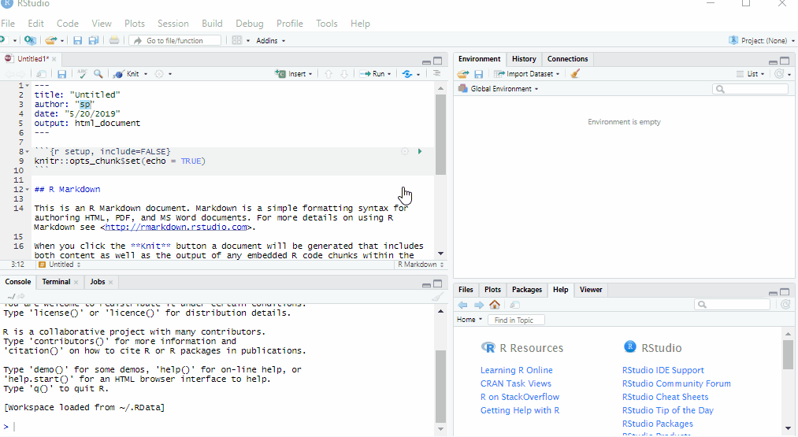
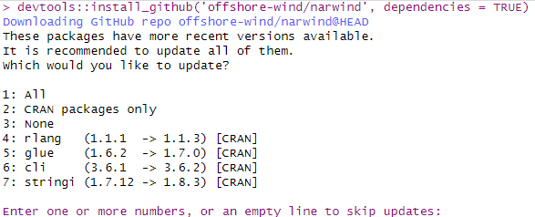
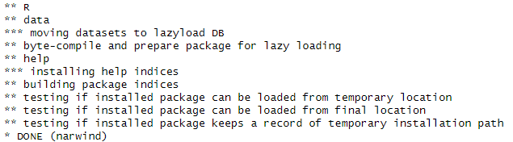

```{r}
downloadthis::download_link(
  link = "https://github.com/fmmattioni/downloadthis/raw/master/inst/example/file_1.pdf",
  button_label = "Download PDF",
  button_type = "primary",
  has_icon = TRUE,
  icon = "fa fa-file-pdf",
  self_contained = FALSE
)
```

## Preamble

This tutorial explains how to download and install the `narwind` package. A primer on the use of R is also given for novice users.

```{r setup, include = FALSE}
knitr::opts_knit$set(root.dir = rprojroot::find_rstudio_root_file())
knitr::opts_chunk$set(
  collapse = TRUE,
  comment = "#>")
```

## Required software

The bioenergetic model implemented in `narwind` is written in the R and C++ programming languages. To run the model, users will need to install the freely available [R software](https://cloud.r-project.org/) on their machines. R is a programming language for data science and graphics, which is especially powerful in performing advanced statistical computing and is widely used in ecology. We also recommend the open-source [RStudio software](https://posit.co/download/rstudio-desktop/), which provides a user-friendly front-end interface to R, with many convenient features and tools, including:

-   The ability to write and save reusable scripts (i.e., text files containing R commands)

-   Easy access to all the imported data and created objects (like variables, functions, etc.)

-   Exhaustive help on any object

-   Code auto-completion

-   The ability to create projects to organize and share work with collaborators

-   Plot previewing

-   Operational history tracking

**It is important to install R first, before installing RStudio.**

To do so, go to the Comprehensive R Archive Network (CRAN) website: <https://cran.r-project.org/>. In the upper part of the screen, find the section entitled "Download and Install R" and click the link corresponding to your operating system.

-   If you are a Windows user: Click on “Download R for Windows”, then click on “base”, then click on the Download link.

-   If you are macOS user: Click on “Download R for macOS”, then under “Latest release:” click on R-X.X.X.pkg, where R-X.X.X is the version number.

-   If you are a Linux user: Click on “Download R for Linux” and choose your distribution for more information on installing R for your setup.

-   Open the downloaded file and follow simple installation instructions leaving default options everywhere.

Next, go to the RStudio website at <https://posit.co/download/rstudio-desktop/>.

-   You will notice that your operating system is automatically identified.

-   Click the blue button to download the latest release of RStudio for your operating system.

-   Open the downloaded file and follow simple installation instructions opting for defaults everywhere.

In addition to R and RStudio, macOS users need to download XQuartz (<https://www.xquartz.org/>).

Opening RStudio will automatically launch the R software. The platform interface should look similar to the image below, although minor layout changes may occur with different versions of R.


The interface can be broadly divided into four areas:

-   the **Source** for your scripts and documents (top-left in the above image, in the default layout)

-   the R **Console** (bottom-left in the above image)

-   the **Environment/History** tabs (top-right in the above image)

-   the **Files/Plots/Packages/Help/Viewer tabs** (bottom-right in the above image)

This default layout can be customised to suit individual needs, as shown here.



Unlike other point-and-click statistical software programs like Excel, SPSS, or Minitab, R is an interpreted language, which means that it works by typing and executing commands written in R code. There are two main ways of interacting with R: by using the **console** or by using **script files** (plain text files that contain code).

The **console** pane in RStudio is the place where commands written in the R language can be typed and executed immediately by the computer. It is also where the results will be shown for commands that have been executed. You can type commands directly into the console and press `Enter` on your keyboard to execute those commands, but they will be forgotten when you close the session. If R is ready to accept commands, the R console by default shows a `>` prompt. If it receives a command (by typing, copy-pasting, or sent from the script editor using `Ctrl` + `Enter`), R will try to execute it, and when ready, will show the results and come back with a new `>` prompt to wait for new commands. If R is still waiting for user input, the console will show a `+` prompt. This usually means that the command being executed is not yet complete. This could happen for instance if a parenthesis or quotation has not been 'closed', i.e. some right-parentheses or closing quotation marks are missing. When this happens, and you thought you finished typing your command, click inside the console window and press `Esc`; this will cancel the incomplete command and return you to the `>` prompt.

However, typing commands in the **script** editor and saving the script for future use is far more useful as it provides a complete record of previous analyses that ensures reproducibility. It also avoids having to re-write an entire piece of code over and over again if the same analysis is to be performed repeatedly. Importantly, R scripts can be annotated with comments that enable analysis decisions to be documented, making the code comprehensible to other users. Comments represent generic sentences that are mostly used for the purposes of documentation (e.g., to keep a record of what a piece of code does), and are ignored by the program (i.e., they are never executed). They begin with a hashtag (`#`) and appear in a different color to the rest of the code for enhanced legibility.

To start a new R script, go to `File` \> `New File` \> `R script`.

Type code directly into the script file. You can save this file on your computer by going to `File` \> `Save as`.

To execute commands from the script editor, hit `Ctrl` + `Enter` on your keyboard (on Macs, `Cmd` + `Enter` will work as well). The command on the current line in the script (as indicated by the placement of the mouse cursor) or all of the commands in the currently selected text will be sent to the console and executed.

It is good practice to keep scripts and analysis outputs related to a specific project in a single folder. Users of R and RStudio can choose which folder to assign as the **working directory** within a given R session. The working directory is the place where R will look for and save files. Whenever R/RStudio is launched, a working directory will automatically be determined based on startup parameters.

To check which working directory R is using, execute the following command:

```{r eval=FALSE}
getwd()
```

To change to a different working directory in R go to the Console and type:

```{r eval=FALSE}
setwd("Path/To/Desired/Workingdirectory")
```

The working directory can also be changed by going to `Session` \> `Set Working Directory` \> `Choose Directory`.

{alt="How to set a working directory with the RStudio interface"}

Alternatively, you can use the shortcut `Ctrl` + `Shift` + `H` to set a working directory in RStudio.

For further information on using R and RStudio, please refer to Claudia Engel's [**Introduction to R**](https://cengel.github.io/R-intro/)book, which is the source of much of the content in this section of the tutorial. If you are coming to R from a traditional point-and-click statistics package such, RStudio’s Thomas Mock has created a free video webinar titled [A Gentle Introduction to Tidy Statistics In R](https://resources.rstudio.com/webinars/a-gentle-introduction-to-tidy-statistics-in-r). This one-hour introduction covers how to get started quickly with the basics of research statistics in R, providing an emphasis on reading data into R, exploratory data analysis, statistical testing, and producing publication-ready plots. Additional RStudio webinars and videos can be found via the topic menus on the left side of that page.

## Package installation

R comes with a base system and some contributed core packages. However, the functionality of R can be significantly extended by using additional contributed packages. Those packages typically contain commands (functions) for more specialized tasks. They can also contain example datasets. `narwind` is an example of such third-party packages which is not included in the standard R download files, and must be manually installed.

`narwind` relies not only on R code but also on compiled code written in the C++ programming language. Because of this, users must follow the steps below to install the package. Note that additional permissions from network administrators may be required to internet access during installation.

-   **Step 1:** Download the development tools appropriate for your operating system.

    -   Windows users – Go to <https://cran.r-project.org/bin/windows/Rtools/> and download the version of RTools that corresponds to the version of R installed on your machine. If unsure, type and execute the following command to check which version of R is running:

        ```{r eval=FALSE}
        R.version
        ```

    -   Mac users: Follow the instructions found at <https://mac.r-project.org/tools/>

-   **Step 2:** In R, install the `devtools` package.

```{r install, eval=FALSE, include=TRUE}
# To install the devtools package, run the following command:
install.packages("devtools")
```

-   **Step 3:** In R, install `narwind`. If necessary, remove previous installations of the package by first calling the `remove.packages` command.

```{r download, eval=FALSE, include=TRUE}
remove.packages("narwind") # If a previous version of narwind is already available
devtools::install_github("offshore-wind/narwind", dependencies = TRUE)
```

-   **Step 4:** You should see some text output similar to the below in the R console. When prompted to update existing packages, type `1` then `Enter` in the console to ensure that all available updates are downloaded.



-   **Step 5:** The installation is complete when the following lines are printed. Note that some warning messages (sometimes shown in red color) may also appear in the R console during this process. These are 'normal' and not indicative of errors that would prevent normal use of the package.



-   **Step 5:** Load the package.In R, packages need to be loaded into the current session for their functions to be made available to users. This is done using the `library()` command, which in the case of `narwind` prints a welcome message with basic information in the R console:

```{r pkg, include = FALSE}
devtools::load_all()
library(narwind)
```

```{r pkg_true, eval = FALSE}
library(narwind)
```

> **Note 1.1:** `narwind` is largely written in C++, a high-level, general-purpose programming language often used in high-performance applications. C++ is a compiled language, meaning that any source code must first be converted into machine-readable code before execution. This compilation process results in an executable file, which is then translated into R functions. No user input is necessary; this step is automatically performed in the background as part of the `library()` call above.

> **Note 1.2:** In R, the `help()` function and `?` help operator provide access to documentation pages for package functions, datasets, or other objects. To access documentation for the `narw()` function, for instance, enter any of the commands: `help(narw)`, `help("narw")`, `?narw`, or `?"narw"` (i.e., the quotes are optional).

## R basics

> **Note 1.3:** The below is taken (and adapted) from *An Introduction to R* by Alex Douglas, Deon Roos, Francesca Mancini, Ana Couto, and David Lusseau (<https://intro2r.com/>)

R is an object-oriented programming language, which means that it uses entities called **objects** to store and interact with data. These objects can be virtually anything, from a single number or character string (like a word) to highly complex data structures like the output of a plot, the summary of a statistical analysis, or a set of R commands that perform a specific task. Understanding how to create objects and assign values to them is key to understanding R.

To create an object, we simply give the object a name. We can then assign a value to this object using the *assignment operator* `<-` (sometimes called the *gets operator*). The assignment operator is a composite symbol comprised of a ‘less than’ symbol `<` and a hyphen `-` . For example:

```{r}
my_obj <- 48
```

In the code above, we created an object arbitrarily called `my_obj` and assigned it the value of `48` using the assignment operator (we can read this as ‘*my_obj gets 48*’). One can also use `=` instead of `<-` to assign values, but this is considered bad coding practice and we would discourage you from using this notation.

To view the value of an object, we simply type the name of the object in the R console and hit `Enter` on the keyboard:

```{r}
my_obj
```

Now that we’ve created this object, R knows all about it and will keep track of it during this current R session. All of the objects that are created are stored in the current workspace and can be viewed in RStudio by clicking on the ‘Environment’ tab in the top right hand pane.

There are many different types of values that can be assigned to an object. For instance:

```{r}
my_obj2 <- "North Atlantic right whales"
```

Here, we created another object, this time called `my_obj2,` and assigned it the value of `"North Atlantic right whales"`, which is a character string. Notice that we have enclosed the string in quotes, as this is the way text is entered in R. If you forget to use the quotes, you will receive an error message.

To change the value of an existing object, we simply reassign a new value to it. For example, to change the value of `my_obj2` from `"North Atlantic right whales"` to the number `1024`, we can type:

```{r}
my_obj2 <- 1024
```

Once we have created a few objects, we can perform operations with them. For example, the following code creates a new object `my_obj3` and assigns it the value of `my_obj` added to `my_obj2` which is 1072 (48 + 1024 = 1072).

```{r}
my_obj3 <- my_obj + my_obj2
my_obj3
```

Naming objects is one of the most difficult things to do in R. Ideally, object names should be kept both short and informative, which is not always straightforward. We recommend using either an underscore or a dot between words or capitalizing words if object names containing multiple words are needed. Some examples are shown below.

```{r, eval=FALSE}
output_summary <- "my analysis"
output.summary <- "my analysis"
outputSummary <- "my analysis"
```

Importantly, note that an object name cannot start with a number or a dot followed by a number (i.e. `2my_variable` or `.2my_variable`). Non-alphanumeric characters (e.g., &, \^, /, ! etc.) or reserved words (i.e. `TRUE`, `NA`) should also be avoided, and it’s never a good idea to give objects the same name as a built-in R function (see below).

The objects above are assigned a single value and are therefore very simple. However, more complex objects can also be created. R **functions** are an example of complex objects. An R function can be thought of as an object which contains a series of instructions to perform a specific task. Functions may be parameterized with one or more **arguments**, which control the way in which those tasks are performed or customize the values used in the internal calculations performed by the function. The base installation of R comes with numerous functions already pre-defined, however one can increase the power of R by installing custom functions from external packages, which is what you have done by installing `narwind`.

There are a couple of really important points to note about R functions. Firstly, when using a function in R, the function name is **always** followed by a pair of round brackets, even if nothing is contained between the brackets (i.e., the function takes no arguments). Secondly, the argument(s) of a function are placed inside the round brackets and are separated by commas.

In the example below, we first create a vector of integer numbers between 1 and 25 using the shorthand `:`, and we then calculate the average of these numbers using the `mean` function.

```{r}
my_numbers <- 1:25
my_numbers
mean(my_numbers)
```

If we wanted to use this average later on in our analysis we could just assign it to another object. The mean

```{r}
my_average <- mean(my_numbers)
```

Note that argument names need not be specified when calling an R function, insofar as they are given in the correct order. For example, the `rnorm` function (which comes with R) can be used to generate random draws from a Normal distribution. The function takes three arguments, namely the number of values to generate, and the mean and standard deviation of the distribution, in this exact order. The two lines of code below are therefore equivalent, and return 10 random variates from a Normal distribution with mean of 120 and standard deviation of 12:

```{r, eval=FALSE}
rnorm(n = 10, mean = 120, sd = 12)
rnorm(10, 120, 12)
```

However, argument names must be given if arguments appear in a different order.

```{r, eval=FALSE}
rnorm(sd = 12, n = 10, mean = 120)
```

R has a built-in help facility that provides information on any function. To access it, simply use the `help()` function. For example, to open the help page for the `mean()` function, type:

```{r, eval=FALSE}
help("mean")
```

or use the equivalent shortcut, `?`.

```{r, eval=FALSE}
?mean
```

The corresponding help page is displayed in the ‘Help’ tab in the Files pane (usually in the bottom right of RStudio).

## Further information

Novice R users may find the below resources useful.

```{r, echo=FALSE}
vembedr::embed_url("https://www.youtube.com/watch?v=yZ0bV2Afkjc")
```

Getting Started with Data in R <https://moderndive.netlify.app/1-getting-started.html>

Introduction to R <https://ourcodingclub.github.io/tutorials/intro-to-r/>

RStudio tutorial <https://www.datacamp.com/tutorial/r-studio-tutorial>

R basics 101 <https://rladiessydney.org/courses/ryouwithme/01-basicbasics-0/>
