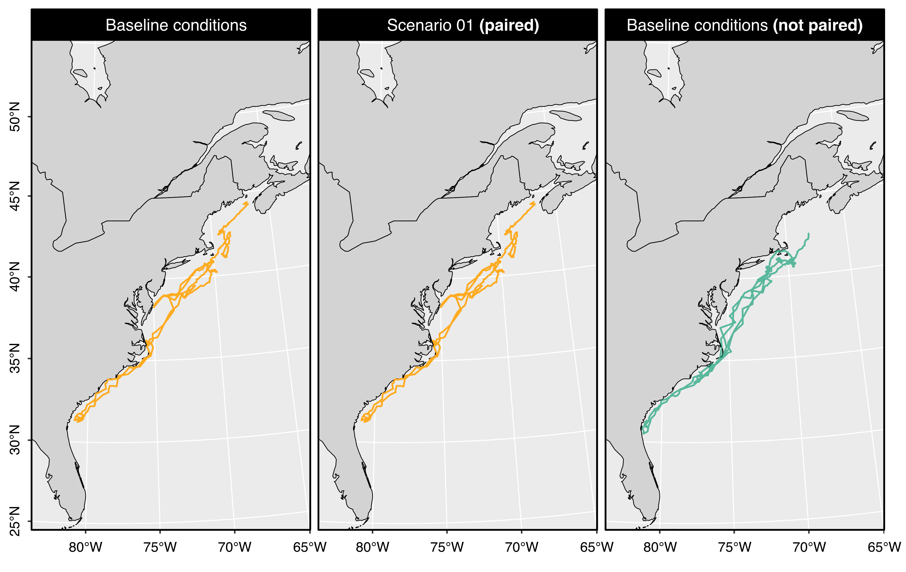

## Preamble

The `narwind` R package provides methods to forecast the population size of critically endangered North Atlantic right whales (NARW, *Eubalaena glacialis*) under user-defined offshore wind development scenarios. `narwind` offers an implementation PCoMS[^1] framework; it is built around a spatially-explicit bioenergetic model, in which the movements of different population cohorts (i.e., juveniles, adult males, pregnant females, resting females, lactating females and their dependent calves) are simulated throughout a full calendar year, and the energy budgets of individual animals are monitored in the context of potential disturbance from anthropogenic activities. Insights gained from the simulator are then used to predict NARW abundance over a time horizon relevant to management (e.g., 25--50 years, consistent with the expected lifespan of a typical wind farm) using a stochastic population model. The spatial simulation operates in daily time steps and accounts for the effects of multiple stressors known or presumed to affect NARW health, reproduction, and survival, namely: (1) direct mortality from vessel strikes, (2) short-term cessation of foraging activity following exposure to pile-driving noise during wind farm construction, and (3) mortality and increased energy expenditure resulting from entanglement in fishing gear.

[^1]: Population Consequences of Multiple Stressors (PCoMS)

This vignette is a step-by-step tutorial designed to showcase the main features of `narwind`.

```{r setup, include = FALSE}
knitr::opts_knit$set(root.dir = rprojroot::find_rstudio_root_file())
knitr::opts_chunk$set(
  collapse = TRUE,
  comment = "#>")
```

> **Note:** Model calibration is still ongoing as of January 31, 2024. The model outputs presented below are therefore provisional and only shown for instructional purposes; results should not presently be used to make inferences about wind farm effects on right whale population size.

## Package installation

The latest development version of the package can be downloaded from the [GitHub](https://github.com/offshore-wind/narwind "narwind on Github"). This requires either the [remotes](https://cran.r-project.org/web/packages/remotes/index.html) or the [devtools](https://cran.r-project.org/web/packages/devtools/index.html) package to be pre-installed.

```{r install, eval=FALSE, include=TRUE}
# To install the remotes package, run the following command:
install.packages("remotes")

# To install the devtools package, run the following command:
install.packages("devtools")
```

> **Note:** In R, comments are indicated by a hash `#` sign and usually appear grayed out (or in a different color to the code itself). Comments represent generic sentences that are mostly used for the purposes of documentation (e.g., to keep a record of what a piece of code does), and are ignored by the program.

```{r download, eval=FALSE, include=TRUE}
# Once either of the above packages is installed, 
# narwind can be downloaded using the <install_github> command
remotes::install_github("offshore-wind/narwind") # OR
devtools::install_github("offshore-wind/narwind")
```

Note that the package relies on compiled code (C++) and functionality provided by the [Rcpp](https://cran.r-project.org/web/packages/Rcpp/index.html) package. The `Rtools` software may be needed on Windows machines.

Installation instructions can be found [here](https://cran.r-project.org/bin/windows/Rtools/rtools40.html).

## Overview

This vignette covers all the steps required to run the bioenergetic model and make predictions of right whale population trends. This includes:

-   Loading the package.
-   Defining bespoke offshore wind scenarios using an interactive [Shiny](https://www.rstudio.com/products/shiny/) web app.
-   Running simulations using the `narw()` function.
-   Inspecting outputs using the `print()` method.
-   Generating summary statistics, simulation diagnostics, and maps using the `summary()` and `plot()` methods.
-   Propagating uncertainty from survival and health models using the `augment()` function.
-   Forecasting population size using the `predict()` method.
-   Visualizing population trends using the `plot()` method.
-   Saving model outputs to disk using the `write()` method.

## Spatial data

`narwind` implements a spatially-explicit bioenergetic model which is informed by several raster surfaces relating to key model parameters, namely:

+---------------------+--------------------+-----------------------------------------------------------------------------------------------------------------------------------------------------+---------------------------------------------------------------------------------------+
| Raster              | Resolution         | Derived from                                                                                                                                        | Source(s) / Data providers                                                            |
+=====================+====================+=====================================================================================================================================================+=======================================================================================+
| Strike risk         | Monthly (10x10 km) | Records of sea-going vessel movements as captured by Automatic Identification Systems (AIS)                                                         | NOAA Fisheries (U.S. waters), MERIDIAN (Canadian waters)                              |
+---------------------+--------------------+-----------------------------------------------------------------------------------------------------------------------------------------------------+---------------------------------------------------------------------------------------+
| Entanglement risk   | Monthly (5x5 km)   | Risk estimates from NOAA's Decision Support Tool, complemented by a comparative analysis of fishing effort within northern U.S. vs. Canadian waters | NOAA Fisheries (U.S. waters), North Atlantic Fisheries Organization (Canadian waters) |
+---------------------+--------------------+-----------------------------------------------------------------------------------------------------------------------------------------------------+---------------------------------------------------------------------------------------+
| Pile-driving noise  | Daily (5x5 km)     | Simple acoustic propagation model, which assumes that transmission loss is dependent on log-range and frequency-specific absorption                 | \-                                                                                    |
+---------------------+--------------------+-----------------------------------------------------------------------------------------------------------------------------------------------------+---------------------------------------------------------------------------------------+
| Prey concentration  | Monthly (10x10 km) | Predictions from a depth-integrated species distribution model for *Calanus finmarchicus*, *Calanus hyperboreus*, and *Calanus glacialis*           | Fisheries and Oceans Canada                                                           |
+---------------------+--------------------+-----------------------------------------------------------------------------------------------------------------------------------------------------+---------------------------------------------------------------------------------------+
| Right whale density | Monthly (5x5 km)   | Predictions from density surface models developed from shipboard and aerial survey data                                                             | Duke University (MGEL)                                                                |
+---------------------+--------------------+-----------------------------------------------------------------------------------------------------------------------------------------------------+---------------------------------------------------------------------------------------+

Further information on each of these inputs can be found under the [Articles](https://offshore-wind.github.io/narwind/articles/) menu.

The package contains all the surfaces required to undertake an assessment of NARW abundance under three hypothetical offshore wind development scenarios (see below), as well as under baseline conditions in the absence of wind farm construction activities.

## Package workflow

A typical workflow, as described in the [Example analysis] below, consists of five steps (Figure 1):

1.  Defining the parameters of one or more target offshore wind scenario(s) using the `scenario()` function.
2.  Running simulations using the `narw()` function, including in the absence of wind farm development activities (i.e., baseline conditions, if relevant).
3.  Inspecting, visualizing, and summarizing model outputs using the `summary()`, `plot()`, and `print()` methods.
4.  Estimating uncertainty associated with health and survival functions, to be propagated into population projections [optional] using the `augment()` function.
5.  Forecasting right whale abundance using the `predict()` method.
6.  Optionally, using the `write()` method to export data for further analysis/reporting.

::: {style="width:550px"}

:::

## Example analysis

### Loading the package

The first step is to load the package. This is done using the `library()` command, which prints a welcome message with basic information in the R console:

```{r pkg, include = FALSE}
devtools::load_all()
library(narwind)
```

```{r pkg_true, eval = FALSE}
library(narwind)
```

> **Note:** `narwind` is largely written in C++, a high-level, general-purpose programming language often used in high-performance applications. C++ is a compiled language, meaning that any source code must first be converted into machine-readable code before execution. This compilation process results in an executable file, which is then translated into R functions. No user input is necessary; this step is automatically performed in the background as part of the `library()` call above.

> **Note:** In R, the `help()` function and `?` help operator provide access to documentation pages for package functions, datasets, or other objects. To access documentation for the `narw()` function, for instance, enter any of the commands: `help(narw)`, `help("narw")`, `?narw`, or `?"narw"` (i.e., the quotes are optional).

### Defining offshore wind scenarios

The package ships with three preset offshore wind scenario objects, which summarize different phases of development at two sites off the Southern New England coast and a third off the Virginia coast (Figure 2). These are provided as objects of class `narwscenario` (`scenario_01`, `scenario_02`, and `scenario_03).`

::: {style="width:850px"}

:::

> **Note:** Throughout this document, we refer to the R objects describing construction or operation activities as **scenarios**. Multiple scenarios (e.g., relating to successive phases of development) together form a **scenario bundle**.

**Scenario 1 (Construction phase -- "unmitigated" case)**

This scenario entails the synchronous construction of all three wind farms at times coinciding with expected peaks in right whale abundance within each respective area (Jan--April in SNE, Jan--March in VA; Figure 3). The objective of this scenario is to explore the potential for cumulative effects of multiple installation activities under unmitigated conditions.

**Scenario 2 (Construction phase -- "mitigated" case)**

This scenario involves shutdowns of installation operations during the main right whale foraging/calving seasons (Nov--Apr). Construction resumes in May at the southward site (Farm 3) and during the late summer to early fall at sites 1 and 2 off New England (Figure 3). In addition, activities at each of the two SNE farms are asynchronous, with noise abatement systems in place to limit noise impacts. Note that a subset of only 60 monopiles are driven at Farm 1 in order to align with Southall et al. (2021).

**Scenario 3 (Operation & maintenance)**

In this scenario, we assume that all three wind farms are in simultaneous and continuous operation (Figure 3). The primary footprint for operations is taken to be vessel traffic to and from wind farm sites; we do not consider vessel movements within farm areas.

::: {style="width:650px"}

:::

As can be seen below, `narwscenario` objects consist of several elements:

-   `phase`: A numeric variable parameter indicating the phase of development (`0` for baseline, `1` for construction, `2` for operations & maintenance).

-   `locs`: A table listing the coordinates of individual wind turbines for each wind farm site. Optionally, `locs` may also contain piling dates for each foundation.

-   `routes`: Spatial lines shapefile representing vessel routes to each wind farm site.

-   `vessels`: A table summarizing the nominal travel speed (in knots), fleet size, and numbers of round trips per foundation for wind farm site, vessel route, and vessel class.

-   `start.month`: A integer vector indicating the month of construction start (1 = January, 12 = December) for each wind farm site. Only relevant if piling dates are not provided in the `locs` table.

-   `start.day`: A integer vector indicating the day of construction start (1 = 1st, 15 = 15th) for each wind farm site. Only relevant if piling dates are not provided in the `locs` table.

-   `piles.per.day`: An integer indicating the number of turbines being installed each day.

-   `ambient`: An integer defining the ambient noise level (in dB).

-   `sourceLvL`: An integer defining the source level (dB) of the hammer strikes; this is assumed to correspond to the exact locations of the turbines, as listed in `locs`.

-   `lowerdB`: An numeric value defining the magnitude of noise attenuation achieved when noise abatement systems are in place (e.g., bubble curtains).

-   `logrange`: Log-range coefficient used in the transmission loss model.

-   `absorb`: Absorption coefficient used in the transmission loss model.

```{r scenario_struct}
str(scenario_01,1)
```

The above parameters can be defined interactively to generate entirely bespoke scenarios using the Shiny app available though the `scenario()` function. A full tutorial detailing the use of the app can be found in a sister vignette (soon to be released).

### Running the model

The bioenergetic model is run by calling the `narw()` function. The number of simulated animals per cohort, `nsim`, is the only mandatory argument; all others are optional and set to default values that reflect baseline conditions when no wind farm activity is occurring. `narwscenario` objects pulled from the Shiny app can be passed to `narw()` using the `scenario` argument.

As an example, the code below can be used to simulate 100 individuals in each population cohort under baseline conditions.

```{r load_model, include = FALSE}
load("data/vignettes/narwind.rda")
```

```{r run_model, eval = FALSE}
m <- narw(nsim = 100)
```

> **Note:** This took 11 min 47 sec to run on a 2021 iMac (M1) running Mac OS Sonoma 14.1.2. However, run times may vary between operating systems.

The arguments that can be passed to `narw()` are listed below.

+--------------+---------------+----------------------------------------------------------------------------------------------------------------------------------------------------------------------------------------------------------------------------------------------------------------------------------------------------------------------+
| Argument     | Default value | Description                                                                                                                                                                                                                                                                                                          |
+==============+===============+======================================================================================================================================================================================================================================================================================================================+
| `nsim`       | `1000`        | Positive integer. Number of simulated animals.                                                                                                                                                                                                                                                                       |
+--------------+---------------+----------------------------------------------------------------------------------------------------------------------------------------------------------------------------------------------------------------------------------------------------------------------------------------------------------------------+
| `scenario`   | `NULL`        | An optional object of class `narwscenario`, as returned by the `scenario()` function.                                                                                                                                                                                                                                |
+--------------+---------------+----------------------------------------------------------------------------------------------------------------------------------------------------------------------------------------------------------------------------------------------------------------------------------------------------------------------+
| `pair`       | `NULL`        | An object of class `narwsim`, to which the current simulation must be matched. With the exception of wind farm parameters, simulation conditions between paired runs are identical; pairing is therefore useful to enable comparative assessments of population projections under competing offshore wind scenarios. |
+--------------+---------------+----------------------------------------------------------------------------------------------------------------------------------------------------------------------------------------------------------------------------------------------------------------------------------------------------------------------+
| `label`      | `""`          | Character. Text label assigned to the simulation object; used for plotting.                                                                                                                                                                                                                                          |
+--------------+---------------+----------------------------------------------------------------------------------------------------------------------------------------------------------------------------------------------------------------------------------------------------------------------------------------------------------------------+
| `piling.hrs` | `4`           | Numeric. Length of time (hours) during which whales cease foraging following a response to pile-driving noise exposure.                                                                                                                                                                                              |
+--------------+---------------+----------------------------------------------------------------------------------------------------------------------------------------------------------------------------------------------------------------------------------------------------------------------------------------------------------------------+
| `n.cores`    | `NULL`        | Positive integer. Number of CPU cores to use for parallel processing. The default value of `NULL` detects the processor configuration and runs computations on the maximum allowable number of available cores.                                                                                                      |
+--------------+---------------+----------------------------------------------------------------------------------------------------------------------------------------------------------------------------------------------------------------------------------------------------------------------------------------------------------------------+

The resulting object is of class `narwsim`:

```{r model_class}
class(m)[1]
```

### Pairing simulations

It is important to note that the bioenergetic model is stochastic, such that successive runs of the model will return different results (e.g., different simulated movement tracks for each animal). However, meaningful comparisons of population projections between contrasting offshore wind scenario bundles are only possible if simulated conditions are maintained between model runs. The `pair` argument was designed to enable this using random seed matching, and allows users to supply an existing `narwsim` object that can act as a "template" for the current simulation (Figure 4).

For instance, the code below performs another run of the model with piling taking place at three sites as defined in the `scenario_01` object (Figure 2). The run is paired with the baseline scenario stored in `m`. With the exception of wind farm-related parameters, all simulated conditions are identical between `m` and `m2`.

```{r model_match, eval = FALSE}
m2 <- narw(nsim = 50, scenario = scenario_01, pair = m)
m3 <- narw(nsim = 50) # Compare to an additional baseline run with no pairing
```

::: {style="width:850px"}

:::

### Viewing data

Outputs from the `narw()` simulator can be viewed in the R console using the `print()` method. `print()` is part of a group of generic functions that can be applied to various R objects and will behave differently depending on the class of the object that is passed to them. Other generic functions include `plot()`, `summary()`, or `write()` (among others) -- these are covered in later sections. `print()` can also be called implicitly, that is, simply by typing the name of the relevant object in the console and pressing `[enter]` on the keyboard. The default behavior for objects of class `narwsim` as returned by `narw()` is to give a tabular overview of the data from the first 5 days of the simulation, for the first animal in each population cohort. Optional arguments allow users to override these default settings and display data for specific days, animals, and/or cohorts. The `print()` method has the following arguments:

+----------+---------------+-------------------------------------------------------------------------------------------------------------------------------------------------------------------------------------------------------------------------------------------------------------+
| Argument | Default value | Description                                                                                                                                                                                                                                                 |
+==========+===============+=============================================================================================================================================================================================================================================================+
| `obj`    | `-`           | Input model object of class `narwsim`, as returned by `narw()`.                                                                                                                                                                                             |
+----------+---------------+-------------------------------------------------------------------------------------------------------------------------------------------------------------------------------------------------------------------------------------------------------------+
| `rowID`  | `1:5`         | Positive integer or vector of positive integers indicating which days of the simulation should be displayed. Defaults to the first first days.                                                                                                              |
+----------+---------------+-------------------------------------------------------------------------------------------------------------------------------------------------------------------------------------------------------------------------------------------------------------+
| `whale`  | `1`           | Positive integer indicating the individual for which data should be extracted. Only the first individual is included by default.                                                                                                                            |
+----------+---------------+-------------------------------------------------------------------------------------------------------------------------------------------------------------------------------------------------------------------------------------------------------------+
| `cohort` | `1:6`         | Positive integer or vector of positive integers indicating which cohorts should be considered. Defaults to all cohorts. Cohort identifiers are listed in an object called `cohorts`. Note that calves are included with their mothers (i.e., `cohort = 5`). |
+----------+---------------+-------------------------------------------------------------------------------------------------------------------------------------------------------------------------------------------------------------------------------------------------------------+

For example, the code below displays the first 5 days of the simulation for the fourth adult male.

```{r model_print}
print(m, rowID = 1:5, whale = 4, cohort = 3)
```

```{r print_all, eval = FALSE}
# By contrast, the below will show all data 
m # Same as print(m)
```

> **Note:** The `print()` method is only used for viewing data inside the R console. To export / save data on disk, use the `write()` method described in the [Exporting data] section.

### Model summary and diagnostics

The `summary()` method provides a range of diagnostics that are helpful for assessing whether simulated whale behavior aligns with biological expectations. These relate to individual (1) health, (2) movements, (3) habitat use, (4) behavior (i.e., activity budgets), (5) stressor exposure, and (6) energy intake vs. expenditure (see Table 1 below).

The function takes the following arguments:

+------------+---------------+---------------------------------------------------------------------------------------------------------------------------------------------------------------------------------------------------------------------------------------------------------------------------------------------+
| Argument   | Default value | Description                                                                                                                                                                                                                                                                                 |
+============+===============+=============================================================================================================================================================================================================================================================================================+
| `obj`      | `-`           | Model object of class `narwsim`, as returned by `narw()`.                                                                                                                                                                                                                                   |
+------------+---------------+---------------------------------------------------------------------------------------------------------------------------------------------------------------------------------------------------------------------------------------------------------------------------------------------+
| `what`     | `"all"`       | Character string indicating which component(s) of the summary to display. Can be one of: `"health"`, `"movements"`, `"habitat"`, `"behavior"`, `"stressors"`, `"strike"`, `"gear"`, `"noise"`, `"other"`, or `"energy"`. See below for details. Defaults to `"all"` for a complete summary. |
+------------+---------------+---------------------------------------------------------------------------------------------------------------------------------------------------------------------------------------------------------------------------------------------------------------------------------------------+
| `relative` | `FALSE`       | Logical. If `TRUE`, percentages are calculated relative to class totals. Defaults to `FALSE`.                                                                                                                                                                                               |
+------------+---------------+---------------------------------------------------------------------------------------------------------------------------------------------------------------------------------------------------------------------------------------------------------------------------------------------+
| `plot`     | `FALSE`       | Logical. If `TRUE`, plots are produced in addition to a text-based summary.                                                                                                                                                                                                                 |
+------------+---------------+---------------------------------------------------------------------------------------------------------------------------------------------------------------------------------------------------------------------------------------------------------------------------------------------+
| `whale`    | `1:nsim`      | Positive integer indicating the individual for which data should be extracted. By default, considers all `nsim` individuals.                                                                                                                                                                |
+------------+---------------+---------------------------------------------------------------------------------------------------------------------------------------------------------------------------------------------------------------------------------------------------------------------------------------------+
| `cohort`   | `1:6`         | Positive integer or vector of positive integers indicating which cohorts should be considered. Defaults to all cohorts. Cohort identifiers are listed in an object called `cohorts`.                                                                                                        |
+------------+---------------+---------------------------------------------------------------------------------------------------------------------------------------------------------------------------------------------------------------------------------------------------------------------------------------------+

+-------------+--------------------------------------+-------+-----------------------------------------------------------------------------------------------------------------------------------------------------------------------------------------------------------------------------------------------+
| Category    | Component                            | Plots | Details                                                                                                                                                                                                                                       |
+=============+======================================+=======+===============================================================================================================================================================================================================================================+
| `health`    | Mortality                            | No    | Whale mortality by region, cohort, and cause of death (i.e., starvation vs. vessel strike) .                                                                                                                                                  |
+-------------+--------------------------------------+-------+-----------------------------------------------------------------------------------------------------------------------------------------------------------------------------------------------------------------------------------------------+
|             | Pregnancy                            | No    | Observed abortion rate in females that started the simulation in a pregnant state.                                                                                                                                                            |
+-------------+--------------------------------------+-------+-----------------------------------------------------------------------------------------------------------------------------------------------------------------------------------------------------------------------------------------------+
|             | Births                               | No    | Mean (range) date of calving events.                                                                                                                                                                                                          |
+-------------+--------------------------------------+-------+-----------------------------------------------------------------------------------------------------------------------------------------------------------------------------------------------------------------------------------------------+
|             | Body condition                       | Yes   | Time series of individual body condition (expressed as relative fat mass), by cohort.                                                                                                                                                         |
+-------------+--------------------------------------+-------+-----------------------------------------------------------------------------------------------------------------------------------------------------------------------------------------------------------------------------------------------+
|             | Growth                               | Yes   | Growth curves, by cohort.                                                                                                                                                                                                                     |
+-------------+--------------------------------------+-------+-----------------------------------------------------------------------------------------------------------------------------------------------------------------------------------------------------------------------------------------------+
| `movements` | Locations                            | No    | Breakdown of (daily) locations by cohort, region, and country (U.S. vs. Canada).                                                                                                                                                              |
+-------------+--------------------------------------+-------+-----------------------------------------------------------------------------------------------------------------------------------------------------------------------------------------------------------------------------------------------+
|             | Destinations                         | No    | Comparison of assigned vs. realized migratory destinations both within and across cohorts. Migratory endpoints include the Southeastern United States calving grounds (SEUS) and Canadian feeding grounds in the Gulf of St Lawrence (GSL).   |
+-------------+--------------------------------------+-------+-----------------------------------------------------------------------------------------------------------------------------------------------------------------------------------------------------------------------------------------------+
|             | Step lengths                         | Yes   | Summary of daily movements, reported as mean (± SD, range) distances traveled per day, by cohort. Distributions of daily step lengths are also visualized by region and as a whole.                                                           |
+-------------+--------------------------------------+-------+-----------------------------------------------------------------------------------------------------------------------------------------------------------------------------------------------------------------------------------------------+
|             | Migration                            | No    | Summary of yearly movements, reported as mean (± SD, range) total distance covered over the time span of the simulation, by cohort.                                                                                                           |
+-------------+--------------------------------------+-------+-----------------------------------------------------------------------------------------------------------------------------------------------------------------------------------------------------------------------------------------------+
| `habitat`   | Occupancy                            | No    | Cohort-specific summary of the numbers of animals visiting each region, and the number of regions visited by animals.                                                                                                                         |
+-------------+--------------------------------------+-------+-----------------------------------------------------------------------------------------------------------------------------------------------------------------------------------------------------------------------------------------------+
|             | Residency                            | No    | Breakdown of days spent in each.                                                                                                                                                                                                              |
+-------------+--------------------------------------+-------+-----------------------------------------------------------------------------------------------------------------------------------------------------------------------------------------------------------------------------------------------+
| `behavior`  | Activity budgets                     | Yes   | Mean (± SD) hours spent engaging in each of the four categories of behavior considered in the model (i.e., traveling, resting, nursing, and feeding), by region. A visual breakdown by region is also produced for each category of behavior. |
+-------------+--------------------------------------+-------+-----------------------------------------------------------------------------------------------------------------------------------------------------------------------------------------------------------------------------------------------+
| `stressors` | Entanglements (`gear`)               | Yes   | Various summaries by cohort, including: entanglement rates, durations, severities, probabilities, and attachment sites along the body.                                                                                                        |
+-------------+--------------------------------------+-------+-----------------------------------------------------------------------------------------------------------------------------------------------------------------------------------------------------------------------------------------------+
|             | Vessel strikes (`strike`)            | No    | Strike rates by cohort.                                                                                                                                                                                                                       |
+-------------+--------------------------------------+-------+-----------------------------------------------------------------------------------------------------------------------------------------------------------------------------------------------------------------------------------------------+
|             | Noise (`noise`)                      | No    | Summary of mean (± SD, range) noise levels encountered, behavioral response thresholds, and numbers of days during which a response to pile-driving was observed.                                                                             |
+-------------+--------------------------------------+-------+-----------------------------------------------------------------------------------------------------------------------------------------------------------------------------------------------------------------------------------------------+
|             | Other sources of mortality (`other`) | No    | Summary of mortality from other sources, by cohort.                                                                                                                                                                                           |
+-------------+--------------------------------------+-------+-----------------------------------------------------------------------------------------------------------------------------------------------------------------------------------------------------------------------------------------------+
| Energy      | Energy budget                        | No    | Mean (± SD, range) daily energy intake and expenditure (expressed in MJ/day), by cohort. Also reported are the mean (± SD, range) % time individuals are in energetic deficit (energy balance \< 0) or surplus (energy balance \> 0).         |
+-------------+--------------------------------------+-------+-----------------------------------------------------------------------------------------------------------------------------------------------------------------------------------------------------------------------------------------------+

: Table 1. Overview of model diagnostics and summary statistics returned by the `summary()` command.

```{r model_summary}
# Summary for adult females only
summary(m, cohort = 4:6)
```

### Plotting model outputs

Several plots can be obtained from `narwsim` objects -- all are produced using the `plot()` method. By default, a call to `plot()` will generate maps of simulated whale tracks, with labels indicating the locations of births (if relevant) and deaths (color-coded by cause of mortality). The number of tracks shown is limited to a maximum of `100` to improve legibility and ensure that the code runs smoothly; we recommend against modifying this default setting, unless absolutely necessary (i.e., fewer/more tracks can be displayed by changing the value passed to the `nL` argument). Similarly to the other methods described in preceding sections, the `cohort` and `whale` arguments can be used to display data for particular cohorts and/or individuals of interest. The `bymonth` and `bywhale` arguments can also be set to `TRUE` to color-code track segments either by calendar month or by individual, respectively. Lastly, when `web` is set to `TRUE`, interactive web-based maps are produced using the [`ggplotly`](https://plotly.com/ggplot2/) R package. These can be zoomed and panned using the mouse cursor to get a closer look at specific areas of interest. The location (easting, northing) and ID of each animal are displayed upon mouse hover.

Other maps/visualizations can be generated using the `what` argument (see details below).

```{r model_plot, eval=FALSE}
plot(m, cohort = 4:5)
```


+-----------+---------------+----------------------------------------------------------------------------------------------------------------------------------------------------------------------------------------------------------------------------------------------------------------------------------------------------------------------+
| Argument  | Default value | Description                                                                                                                                                                                                                                                                                                          |
+===========+===============+======================================================================================================================================================================================================================================================================================================================+
| `obj`     | `-`           | Model object of class `narwsim`, as returned by `narw()`.                                                                                                                                                                                                                                                            |
+-----------+---------------+----------------------------------------------------------------------------------------------------------------------------------------------------------------------------------------------------------------------------------------------------------------------------------------------------------------------+
| `what`    | `"map"`       | Character string indicating which plots to return. Set to:                                                                                                                                                                                                                                                           |
|           |               |                                                                                                                                                                                                                                                                                                                      |
|           |               | -   `"map"` (default) to generate maps of simulated tracks                                                                                                                                                                                                                                                           |
|           |               |                                                                                                                                                                                                                                                                                                                      |
|           |               | -   `"pred"` to visualize how survival and body condition are predicted to vary as a function of individual health                                                                                                                                                                                                   |
|           |               |                                                                                                                                                                                                                                                                                                                      |
|           |               | -   `"inits"` to check the starting locations of individuals in each month                                                                                                                                                                                                                                           |
|           |               |                                                                                                                                                                                                                                                                                                                      |
|           |               | -   `"migrate"` to display areas where whales were actively moving northwards                                                                                                                                                                                                                                        |
|           |               |                                                                                                                                                                                                                                                                                                                      |
|           |               | -   `"feed"` to display areas where feeding occurred                                                                                                                                                                                                                                                                 |
+-----------+---------------+----------------------------------------------------------------------------------------------------------------------------------------------------------------------------------------------------------------------------------------------------------------------------------------------------------------------+
| `whale`   | `1:nsim`      | Positive integer or vector of integers indicating the individual(s) for which data should be extracted. By default, the function plots tracks for all `nsim` simulated animals.                                                                                                                                      |
+-----------+---------------+----------------------------------------------------------------------------------------------------------------------------------------------------------------------------------------------------------------------------------------------------------------------------------------------------------------------+
| `cohort`  | `1:6`         | Positive integer or vector of positive integers indicating which cohorts should be considered. Defaults to all cohorts. Cohort identifiers are listed in an object called `cohorts`.                                                                                                                                 |
+-----------+---------------+----------------------------------------------------------------------------------------------------------------------------------------------------------------------------------------------------------------------------------------------------------------------------------------------------------------------+
| `web`     | `FALSE`       | Logical. Whether to produce static maps (`FALSE`) or interactive, web-based maps (`TRUE`).                                                                                                                                                                                                                           |
+-----------+---------------+----------------------------------------------------------------------------------------------------------------------------------------------------------------------------------------------------------------------------------------------------------------------------------------------------------------------+
| `nL`      | `100`         | Positive integer. Number of tracks to plot (when `what = "map"`) or number of draws to plot from the Bayesian posterior distribution of survival, health, and gestation models (when `what = "pred"`). In the former case, this argument should be kept \< 100 to minimize memory usage and avoid lengthy run times. |
+-----------+---------------+----------------------------------------------------------------------------------------------------------------------------------------------------------------------------------------------------------------------------------------------------------------------------------------------------------------------+
| `animate` | `FALSE`       | Logical indicating whether a video animation should be produced. This feature is currently only in development and significantly increases run times.                                                                                                                                                                |
+-----------+---------------+----------------------------------------------------------------------------------------------------------------------------------------------------------------------------------------------------------------------------------------------------------------------------------------------------------------------+

### Propagating uncertainty {data-link="Exporting data"}

At the end of each run, generalized additive models (GAMs) are fitted to simulator outputs to assess how the initial health status of individuals within each population cohort affected their body condition and survival trajectories across the year. The fitted GAMs inform the stochastic population model used to generate predictions of future right whale abundance. Forward propagation of the uncertainty associated with GAM coefficients is indispensable for decision-making, and can be achieved using the `augment()` function. `augment()` performs random draws from the posterior distributions of GAM coefficients using a Bayesian Metropolis-Hastings algorithm and returns replicate realizations of the fitted smooths.

```{r augment, echo = FALSE, eval = FALSE}
m <- augment(m)
```

The model object `m` now contains an additional component called `post` where the posterior draws have been saved.

```{r augment_str}
str(m, 1)
```

> **Note:** The use of `augment()` is not compulsory but is highly recommended. Population projections obtained without running `augment()` first will only account for process variance (i.e., the uncertainty resulting from replicate projections).

### Predicting whale abundance {data-link="Exporting data"}

The `predict()` method implements a stochastic population model and allows users to both generate and summarize `n` replicate projections of right whale abundance over a time horizon of interest (e.g., 35 years from current, which is the default). Longer projections can be obtained by modifying the `yrs` argument, which can either be specified as a desired number of years or as a target year for the end of the projection.

Prediction uncertainty is estimated from both process variance (i.e., replicate projections) and parameter uncertainty (i.e., statistical uncertainty in the relationships between individual body condition and health/survival, respectively). The latter is considered only if replicate coefficients have been sampled from the posteriors of the fitted survival and body condition GAMs using the `augment()` function.

`predict()` assumes that piling activities take place right at the onset of the projection (i.e., in year 1), such that the `piling` argument is set to `1`. In this case, two `narwsim` objects respectively relating to the construction and the operation & maintenance phases of development, need to be passed to `predict()`. If `piling > 1`, such that construction occurs at some time point between the start and the end of the projection, then an additional `narwsim` object representing baseline conditions (in the absence of wind farm activity) is also required to cover the period until construction begins.

> **Note:** If a single `narwsim` object is passed to `predict()`, then `piling` is ignored if the `phase` attribute of the input object is `0` or `2`. This allows projections to be obtained for baseline conditions only (`phase = 0`) or operations & maintenance conditions only (`phase = 2`).

Note also that `predict()` cannot process more than one scenario bundle at a time; therefore, separate calls to `predict()` must be made to compare population projections for multiple, alternative scenarios, e.g. involving different schedules of piling, different wind farm sites etc.

The table below details the arguments that `predict()` accepts.

+------------+---------------+--------------------------------------------------------------------------------------------------------------------------------------------------------------------------------------------------------------------------+
| Argument   | Default value | Description                                                                                                                                                                                                              |
+============+===============+==========================================================================================================================================================================================================================+
| `obj`      | `-`           | One or more objects of class `narwsim`, as returned by `narw()`.                                                                                                                                                         |
+------------+---------------+--------------------------------------------------------------------------------------------------------------------------------------------------------------------------------------------------------------------------+
| `n`        | `1000`        | Integer. Number of replicates projections.                                                                                                                                                                               |
+------------+---------------+--------------------------------------------------------------------------------------------------------------------------------------------------------------------------------------------------------------------------+
| `yrs`      | `35`          | Integer. Time horizon, specified either as the desired number of years (from current) or the desired target end year. Defaults to `35`, which is commensurate with the expected average lifespan of a typical wind farm. |
+------------+---------------+--------------------------------------------------------------------------------------------------------------------------------------------------------------------------------------------------------------------------+
| `param`    | `TRUE`        | If `TRUE`, prediction variance includes parameter uncertainty.                                                                                                                                                           |
+------------+---------------+--------------------------------------------------------------------------------------------------------------------------------------------------------------------------------------------------------------------------+
| `piling`   | `1`           | Integer. Year of construction. By default, piling occurs on the first year of the projection, followed by O&M for the remainder.                                                                                         |
+------------+---------------+--------------------------------------------------------------------------------------------------------------------------------------------------------------------------------------------------------------------------+
| `progress` | `TRUE`        | Logical. If `TRUE`, a progress bar is printed to the R console during execution.                                                                                                                                         |
+------------+---------------+--------------------------------------------------------------------------------------------------------------------------------------------------------------------------------------------------------------------------+

```{r predict_narw, eval = FALSE}
narw.preds <- predict(m)
```

```{r preds, echo=FALSE}
narw.preds <- predict(m, n = 10)
```

> **Note:** `predict()` returns an object of class `narwproj`, which contains several datasets and model outputs in list format. Any call to `predict()` must therefore be assigned to an R object, as shown below.

Population trends can be visualized using the `plot()` command. When set to `TRUE`, the `cohort` argument shows time series of abundance for each population cohort, rather than for the whole population (the default). The `interval` argument can be used to display/hide confidence intervals around the trend. Setting the `noaa` argument to `TRUE` will overlay the population trend estimated by Runge *et al.* (2023). Other parameters can be modified to adjust plot aesthetics (see below).

+------------+---------------+-------------------------------------------------------------------------------------------------------------------------------------------------------------------+
| Argument   | Default value | Description                                                                                                                                                       |
+============+===============+===================================================================================================================================================================+
| `interval` | `TRUE`        | Logical. If `TRUE`, percentile confidence intervals are shown on the plots.                                                                                       |
+------------+---------------+-------------------------------------------------------------------------------------------------------------------------------------------------------------------+
| `cohort`   | `FALSE`       | Logical. If `TRUE`, separate plots are returned for each population cohort. If `FALSE`, a single plot of the overall population trend is shown.                   |
+------------+---------------+-------------------------------------------------------------------------------------------------------------------------------------------------------------------+
| `noaa`     | `FALSE`       | Logical. If `TRUE` the population trajectory predicted as part of NOAA's population viability analysis (Runge et al., 2023) is also plotted. Defaults to `FALSE`. |
+------------+---------------+-------------------------------------------------------------------------------------------------------------------------------------------------------------------+
| `scales`   | `"free"`      | Character. Defines whether axis scales should be constant or vary across plots. Can be one of `"fixed"` or `"free"` (the default).                                |
+------------+---------------+-------------------------------------------------------------------------------------------------------------------------------------------------------------------+
| `ncol`     | `3`           | Integer. Number of columns for the plot layout when `cohort = TRUE`.                                                                                              |
+------------+---------------+-------------------------------------------------------------------------------------------------------------------------------------------------------------------+
| `nx`       | `5`           | Integer. Desired number of x-axis intervals. Non-integer values are rounded down.                                                                                 |
+------------+---------------+-------------------------------------------------------------------------------------------------------------------------------------------------------------------+
| `ny`       | `5`           | Integer. Desired number of y-axis intervals. Non-integer values are rounded down.                                                                                 |
+------------+---------------+-------------------------------------------------------------------------------------------------------------------------------------------------------------------+

```{r poptrends_all}
plot(narw.preds)
```

```{r poptrends_bycohort, eval=FALSE}
plot(narw.preds, cohort = TRUE)
```

```{r poptrends_cohort, echo=FALSE, fig.width=8,fig.height=10}
plot(narw.preds, cohort = TRUE, vignette = TRUE, ncol = 2)
```

### Exporting data

The `write()` method is the gateway for saving data on disk. When calling `write()`, model outputs are exported as a Microsoft Excel spreadsheet (.xlsx), stored in the user's current working directory. `write()` can be used with both objects of class `narwsim` and `narwproj`; in the former case, a separate file will be produced for each cohort in `cohortID`. It is recommended to only use this function for short simulation runs (`nsim = 100`) or less, or to use the `cohort` and `whale` arguments to extract data for specific individuals/cohorts. If the simulation run was given a label when using `narw()`, then this label is appended to the output file name.

+--------------+----------+---------------+-----------------------------------------------------------------------------------------------------------------------------+
| Object class | Argument | Default value | Description                                                                                                                 |
+==============+==========+===============+=============================================================================================================================+
| `narwsim`    | `obj`    | `-`           | Input model object, as returned by `narw()`.                                                                                |
+--------------+----------+---------------+-----------------------------------------------------------------------------------------------------------------------------+
|              | `prefix` | `"narwsim"`   | Character string. Prefix appended to the output file name.                                                                  |
+--------------+----------+---------------+-----------------------------------------------------------------------------------------------------------------------------+
|              | `whale`  | `1:nsim`      | Positive integer indicating the individual(s) for which data should be extracted. By default, all individuals are included. |
+--------------+----------+---------------+-----------------------------------------------------------------------------------------------------------------------------+
|              | `cohort` | `1:6`         | Positive integer or vector of positive integers indicating which cohort(s) should be considered. Defaults to all cohorts.   |
+--------------+----------+---------------+-----------------------------------------------------------------------------------------------------------------------------+
| `narwproj`   | `obj`    | `-`           | Input projection object, as returned by `predict()`.                                                                        |
+--------------+----------+---------------+-----------------------------------------------------------------------------------------------------------------------------+
|              | `prefix` | `"narwproj"`  | Character string. Prefix appended to the output file name.                                                                  |
+--------------+----------+---------------+-----------------------------------------------------------------------------------------------------------------------------+
|              | `...`    |               | Additional arguments passed to `write.xlsx`                                                                                 |
+--------------+----------+---------------+-----------------------------------------------------------------------------------------------------------------------------+

```{r save, eval=FALSE}
write(m, whale = 1:10, cohort = 5)
write(narw.preds, prefix = "NARW_abundance")
```
