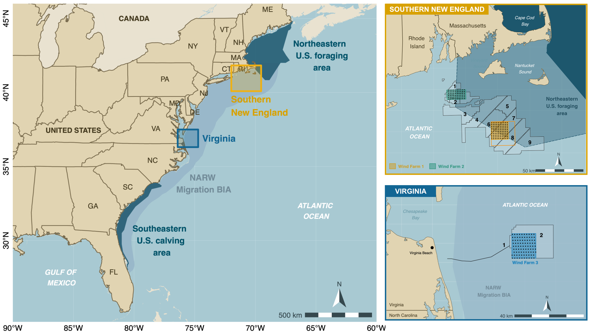
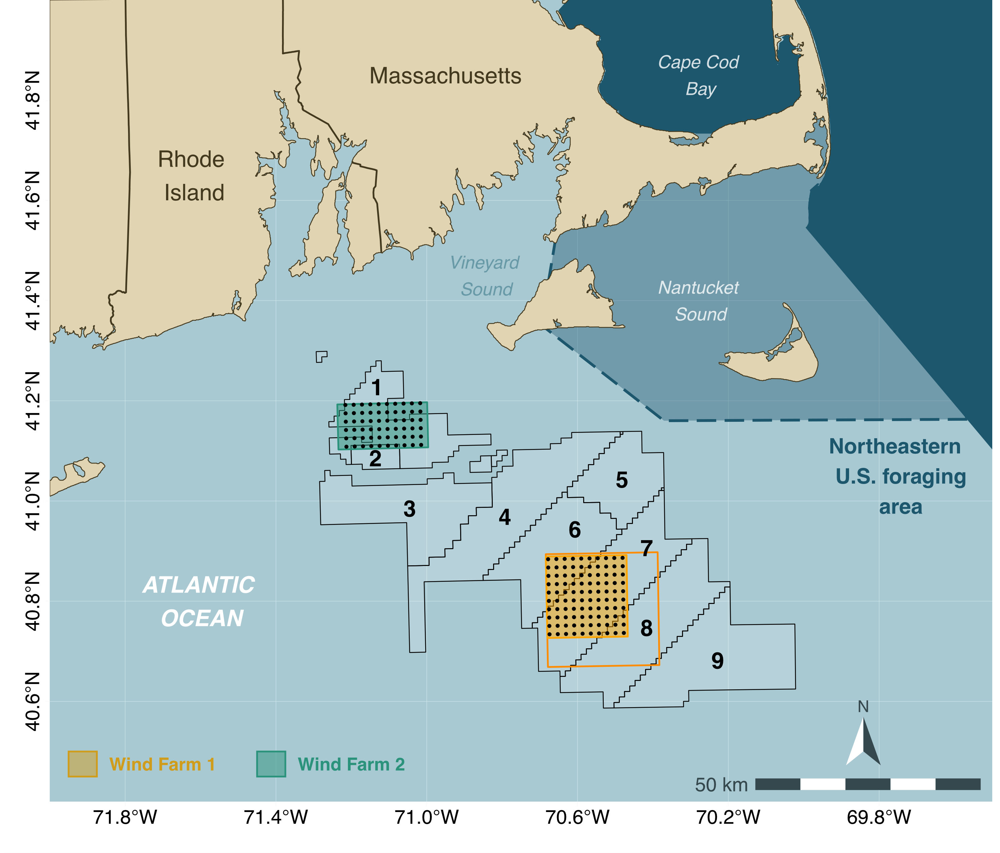
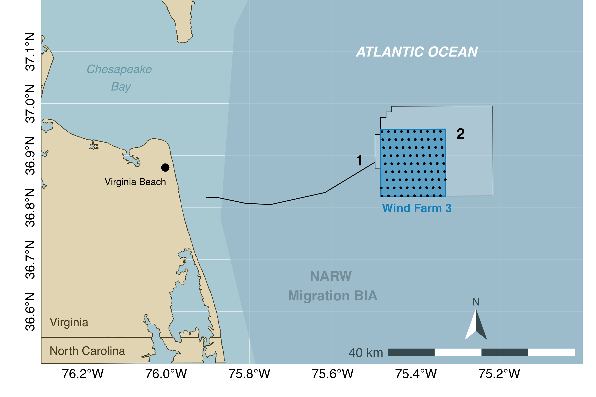
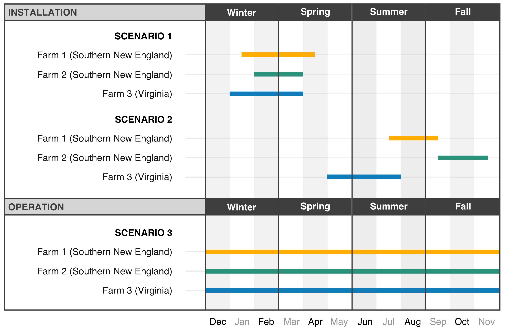
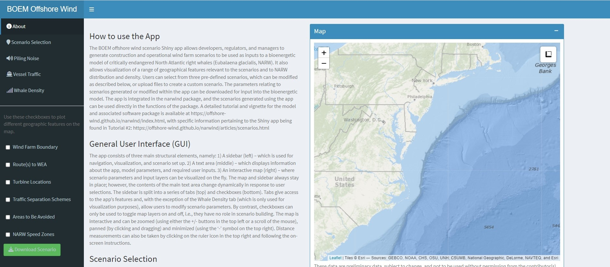
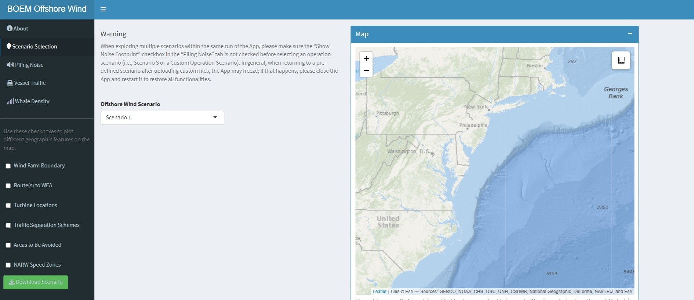
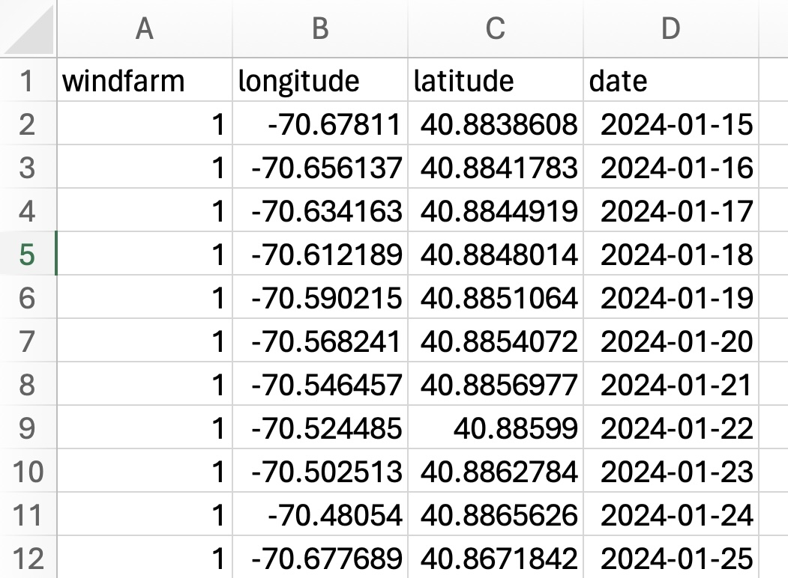

```{r setup, include = FALSE}
knitr::opts_knit$set(root.dir = rprojroot::find_rstudio_root_file())
knitr::opts_chunk$set(
  collapse = TRUE,
  comment = "#>")
```

```{r load_model, include=FALSE}
devtools::load_all()
```

```{r, echo = FALSE}
downloadthis::download_link(
  link = "https://raw.githubusercontent.com/offshore-wind/narwind/4b37f5aaa25ff5be9f2e175a98796a840e7237b4/vignettes/pdf/2%20Defining%20scenarios.pdf",
  button_label = "Download PDF",
  button_type = "primary",
  has_icon = TRUE,
  icon = "fa fa-file-pdf",
  self_contained = FALSE
)
```

## Preamble

This tutorial describes how to define custom offshore wind scenarios for use in the bioenergetic model. Preset scenarios co-developed with BOEM (for demonstration purposes) are also available.

## Example scenarios

The `narwind` package comes with three preset offshore wind scenarios, which summarize hypothetical phases of development at two sites off the Southern New England coast and a third off the Virginia coast (Figure 2.1).

Those sites were chosen as they represent two of the largest commercial offshore wind energy projects earmarked for development along the U.S. Atlantic seaboard in the next five years, and both overlap (or are in close proximity to) critical habitats for right whales, including the species’ migratory corridor (relevant to both Virginia and New England), as well as important feeding grounds such as Georges Bank and Nantucket Shoals (relevant to New England) (Figure 2.1). Additionally, each area is used by different cohorts of the population in different seasons, allowing for: (1) scenarios with asynchronous construction schedules to be considered, and (2) assessments of impacts at different stages of the NARW life cycle. To maintain consistency with previous studies, the Southern New England test case follows the specific wind farm scenarios defined in @Southall2021.

> **Note 2.1:** While realistic, these scenarios are not prescriptive and were designed only to demonstrate the benefits of adopting a bioenergetic modeling approach for conducting impact assessments on large baleen whales.

::: {style="width:850px"}

:::

> **Note 2.2:** Throughout this document, we refer to the R objects describing construction or operation activities as **scenarios**. Multiple scenarios (e.g., relating to successive phases of development spanning several years) are referred to as a **scenario bundle**.

### Southern New England (SNE)

For consistency with existing risk assessment frameworks [@Southall2021], the default scenarios explore various patterns of installation, operation, and mitigation of two separate wind farms positioned within non-overlapping lease areas off Southern New England (Figure 2.2). These sites were identified following extensive consultations with BOEM, and with the intention to consider two developments that: (i) are similar but not identical to any current leases or proposed installation areas, (ii) lie at either end of the wind farm size spectrum for planned construction along the U.S. Atlantic seaboard, and (iii) are not adjacent to one another but are sufficiently close that their effects may be cumulative (Southall et al. 2021). Wind farm 1 is square in shape and covers an area of ca. 324 km 2 (18 x 18 km, approximately half the size of the corresponding site in (Southall et al. 2021), centered on (70.58°W, 40.81°N). This farm overlaps three lease areas (i.e., Beacon Wind OCS-A 0520, Mayflower Wind OCS-A 0521, and New England Wind OCS-A 0534), and represents a scenario slightly smaller than the largest existing or proposed offshore facilities currently being considered off the U.S. east coast. Wind farm 2 is rectangular in shape and covers an area of 200 km 2 (10 x 20 km), centered on (71.12°W, 41.15°N). This farm mainly overlaps one lease area (Revolution Wind, OCS-A 0486; marginal overlap with South Fork Wind, OCS-A 0517), and represents a scenario slightly larger than the smallest existing or proposed offshore facilities currently being considered off the U.S. east coast. A summary of the main characteristics of each wind farm is given in the accompanying project report.



To mimic realistic conditions, both wind farms are assumed to be developed using monopiles only. This includes a total of 100 monopiles in Farm 1 and 60 monopiles in Farm 2, following @Southall2021. In keeping with U.S. Coast Guard recommendations, farm installations are to be oriented according to a fixed grid design consisting of east-to-west rows and north-to-south columns with a one nautical mile (1.85 km) spacing (Figure 2.2). This uniform layout was adopted following extensive stakeholder consultation and provides adequate separation among individual turbines to alleviate hazards to navigation and allow for potential search and rescue operations. Installation is performed using hydraulic impact and/or vibratory pile driving by fleets of jack-up, anchored, or dynamic positioning vessels – along with necessary support and supply vessels. Typical pile driving operations are expected to take 1 to 4 hours.

### Virginia (VA)

Wind farm 3 is square in shape and covers an area of ca. 196 km 2 (14 x 14 km), centered on (75.41°W, 36.89°N). The boundary of the lease area is located approximately 45 km from the northwest corner of the Eastern Shore Peninsula and 50 km east of Virginia Beach, VA. This farm overlaps lease area OCS-A 0483, which is part of the commercial development phase of the Coastal Virginia Offshore Wind (CVOW) project (Figure 2.3). The pilot phase of the project was completed in 2020 with the installation of two 6 MW turbine generators in adjacent lease area OCS-A 0497.



A total of 90 monopiles are installed in Farm 3 under the proposed scenario. This is proportionally within the bounds of the CVOW project design envelope (n = 179–205, for a lease area twice the size of Farm 3). The preferred layout is a grid pattern oriented at 35 degrees to minimize wake losses within the wind farm. Turbines are expected to be placed approximately 0.75 nm (1.39 km) apart in an east-west direction and 0.93 nm (1.72 km) apart in a north-south direction. These distances may vary slightly during construction (subject to micro-siting); however, those variations are ignored for the purposes of scenario exploration. This turbine layout has been designed to maximize power density in the lease area while minimizing costs to the rate payer under the Virginia Clean Economy Act and considering all existing uses of OCS-A 0483 and surrounding waters, including shipping traffic patterns, commercial and recreational fishing activities, marine safety, and impacts to biological and cultural resources.

### Timing of activities

Piling schedules vary between scenarios, as detailed below.

**Scenario 1 (Construction phase -- "unmitigated" case)**

This scenario entails the synchronous construction of all three wind farms at times coinciding with expected peaks in right whale abundance within each respective area (Jan--April in SNE, Jan--March in VA; Figure 2.4). The objective of this scenario is to explore the potential for cumulative effects of multiple installation activities under unmitigated conditions.

**Scenario 2 (Construction phase -- "mitigated" case)**

This scenario involves shutdowns of installation operations during the main right whale foraging/calving seasons (Nov--Apr). Construction resumes in May at the southward site (Farm 3) and during the late summer to early fall at sites 1 and 2 off New England (Figure 2.4). In addition, activities at each of the two SNE farms are asynchronous, with noise abatement systems in place to limit noise impacts. Note that a subset of only 60 monopiles are driven at Farm 1 in order to align with previous BOEM studies.

**Scenario 3 (Operation & maintenance)**

In this scenario, we assume that all three wind farms are in simultaneous and continuous operation (Figure 2.4). The primary footprint for operations is taken to be vessel traffic to and from wind farm sites; we do not consider vessel movements within farm areas.

::: {style="width:650px"}

:::

### Scenario objects in R

The parameters of all three preset scenarios are summarized in dedicated R objects (called `scenario_01`, `scenario_02`, and `scenario_03`). We can use the `str()` function in R (which stands for 'structure') to take a closer look at the contents of each scenario object. For example, here is an abridged representation of the structure of `scenario_01`:

```{r scenario_struct}
str(scenario_01,1)
```

The output above tells us that the `scenario_01` object comprises several elements:

-   `phase`: A numeric variable indicating the phase of development (`0` for baseline, `1` for construction, `2` for operations & maintenance).

-   `locs`: A table listing the coordinates of individual wind turbines for each wind farm site. If the scenario involves construction activities, `locs` also contains piling dates for each foundation.

-   `routes`: A spatial lines shapefile representing vessel routes to each wind farm site.

-   `vessels`: A table summarizing the nominal travel speed (in knots), fleet size, and numbers of round trips per foundation for each wind farm site, vessel route, and vessel class.

-   `start.month`: An integer vector indicating the month of construction start (1 = January, 12 = December) for each wind farm site.

-   `start.day`: An integer vector indicating the day of construction start (1 = 1^st^, 15 = 15^th^) for each wind farm site.

-   `piles.per.day`: An integer indicating the number of turbines being installed each day.

-   `ambient`: An integer defining the ambient noise level (in dB re 1µPa).

-   `sourceLvL`: An integer defining the source level (in dB re 1µPa) of the hammer strikes.

-   `lowerdB`: A numeric value defining the magnitude of noise attenuation (in dB re 1µPa) achieved when noise abatement systems are in place (e.g., bubble curtains).

-   `logrange`: A numeric value for the log-range coefficient used in the transmission loss model.

-   `absorb`: A numeric value for the absorption coefficient used in the transmission loss model.

The agent-based bioenergetic model uses scenario objects to define disturbance conditions in the simulations (see Tutorial 3).

## Custom scenarios

Users can modify the above parameters or upload new custom files to generate bespoke scenarios for other wind farm sites of interest. This is achieved through an interactive, point-and-click Shiny app, which can be launched using the `scenario()` command. Custom scenarios can be downloaded from the app (see details below) and will also be automatically loaded in the current R session upon closing the app window, so that they can be passed to the agent-based model directly.

```{r app_launch, eval = FALSE}
scenario()
```

### App interface

The app consists of three main structural elements (Figure 2.5), namely:

-   A sidebar (left) – which is used for navigation, visualization, and scenario set up.

-   A text area (middle) – which displays information about the app, model parameters, and required user inputs.

-   An interactive map (right) – where scenario parameters and input layers can be visualized on the fly.



The map and sidebar always stay in place, however the contents of the main text area change dynamically in response to user selections.

The sidebar is split into a series of tabs (top) and checkboxes (bottom). Tabs give access to the app's features and, with the exception of the `Whale Density` tab (which is only used for visualization purposes), allow users to modify scenario parameters. By contrast, checkboxes can only be used to toggle map layers on and off, i.e., they have no role in scenario building.

The map is interactive and can be zoomed (using either the `+/-` buttons in the top left or a scroll of the mouse), panned (by clicking and dragging) and minimized (using the `-` symbol on the top right). Distance measurements can also be taken by clicking on the ruler icon in the top right and following the on-screen instructions.

Designing a custom offshore wind scenario can be done in one of two ways:

-   By modifying one of the three preset scenarios available in the package

-   By generating a scenario from scratch

We explain how to do this in the sections below.

### Scenario set up

First, start by clicking on the `Scenario Selection` tab. The central text area will change to reveal several drop-down menus (Figure 2.6).

To adapt one of the pre-defined scenarios, choose either `Scenario 1`, `Scenario 2`, or `Scenario 3` as appropriate. The parameters associated with the selected scenario will be populated throughout the rest of the app. The scenario can then be viewed, and the default scenario parameters can be modified using the controls found in the `Piling Noise` and `Vessel Traffic` tabs. Modifications to scenario parameters will feed through to an R object that can be used directly in the bioenergetic model upon closing the app window.

To define a custom scenario, choose `Custom Scenario`. Three new fields will appear, allowing the user to upload files for the piling locations and timings, the vessel routes, and the vessel information table that underpin the scenario they wish to explore. Please note that uploading custom vessel routes requires the selection of all files that comprise a shapefile (usually four). An additional drop-down menu will also be available to indicate whether the custom scenario relates to construction or operation activities. This is important, as it ensures that the scenario object is correctly labeled. The custom scenario can then be viewed in the same way as the pre-defined scenarios, and scenario parameters can be modified using the controls found in the `Piling Noise` and `Vessel Traffic` tabs. As with the pre-defined scenarios, modifications made to scenario parameters within the app tabs can be saved into an R object that will be used in the bioenergetic model.



Turbine locations must be provided as a `.csv` file containing a minimum of three columns (Figure 2.7): a `windfarm` column with a unique, sequential integer ID number for each wind farm site (starting at 1), a `longitude` column, and a `latitude` column. For construction scenarios, a `date` column must also be supplied to indicate when each pile is due to be installed. For operation scenarios, turbine locations should be provided, but there should not be a date column in this file.

{width="500"}

Similarly, vessel routes to each wind farm site must be provided as a `.shp` file of spatial line features, each with the following attributes: a `windfarm` ID (same as above) and a sequential `routeID` number (`1`, `2`, etc.) for each route associated with a particular farm.

Finally, the user should provide a `.csv` file with all vessel information for each class of vessels associated with each wind farm site and route. This should include columns `phase` (indicating whether the scenario involves `Construction` or `Operation` activities), `vesselclass` (the class of vessels), `site` (a site ID), `windfarm` (a sequential integer ID number for each wind farm site), `route` (a sequential integer ID number for each route associated with each wind farm site), `speed_knt` (the speed in knots for vessels in that class), `Nvessels` (the number of vessels in that class), `roundtrips_foundation` (the number of round trips per foundation) and `routeID` (reporting two values separated by a dash: the wind farm number and the route number therein; e.g. 1-2 for route 2 for wind farm 1).

> **Note 2.3:** When exploring multiple scenarios within the same run of the App, please make sure the `Show Noise Footprint` checkbox in the `Piling Noise` tab is not checked before selecting an operation scenario (i.e., Scenario 3 or a Custom Operation Scenario). In general, when returning to a pre-defined scenario after uploading custom files, the App may freeze; if that happens, please close the App and restart it to restore all functionalities.

### Piling Noise

The acoustic footprint of pile-driving can be visualized as a circular buffer centered on a given piling location. Buffer boundaries mark the distance at which noise levels have decreased to a target value, under the assumption that transmission loss (TL) depends on log-range (log10R) and frequency-specific absorption. If the selected scenario relates to the construction phase, then ticking the `Show noise footprint` checkbox will add buffers to the map and activate additional controls. If the scenario relates to the operational phase of a wind farm site, then there are no changes to be made on this tab. When the scenario involves a construction phase, then the following can be viewed and modified by the user:

**Target Noise Level**

This slider controls the size of the footprint shown; a larger value corresponds to a smaller buffer, as noise levels are highest at the piling site and decline with increasing distance from the source. This slider is for visualization only, i.e., it has no effect on any scenario parameters that feed into the bioenergetic model.

**Piling Date**

This slider can be used to cycle through the calendar year and display wind farm scenario parameters for a chosen day. The play button can be used to launch a day-by-day animation. This slider is for visualization only, i.e., it has no effect on any scenario parameters that feed into the bioenergetic model.

**Source level value**

By default, the source level is set to the value associated with the selected scenario or uploaded scenario but can be modified by the user on this tab. Any changes to this number will be included as a scenario parameter value.

**Log-range Coefficient**

As a sound wave propagates from a localized source, its energy spreads over an increasingly larger area and its intensity therefore declines. This parameter controls the rate at which spreading loss occurs. Higher values capture stronger range attenuation. By default, the Log-range coefficient is set to the value associated with the selected scenario or uploaded scenario but can be modified by the user on this tab. Any changes to this number will be included as a scenario parameter value.

**Absorption Coefficient**

This parameter determines the rate at which sound energy is transformed into heat as the sound wave propagates away from the source, inducing friction between water molecules. The value of the absorption coefficient (in dB/km) depends on the frequency of the sound, and likely varies with water properties such as temperature. By default, the Absorption coefficient is set to the value associated with the selected scenario or uploaded scenario but can be modified by the user on this tab. Any changes to this number will be included as a scenario parameter value.

**Noise Mitigation**

This parameter controls the reduction in source level achieved using noise abatement systems such as bubble curtains. By default, the magnitude of noise attenuation is set to the value associated with the selected scenario or uploaded scenario but can be modified by the user on this tab. Any changes to this number will be included as a scenario parameter value.

At the bottom of this tab there is a button allowing for values to be reset to the default for the scenario. Any user-modified values will be reflected in the final R object that will be used in the bioenergetic model.

### Vessel Traffic

The vessel traffic tab allows the user to visualize and modify the vessel strike risk surface that is used in the bioenergetics model. Vessel strike risk is evaluated using a simple metric, Total PLETH, which accounts for both the effect of vessel speed on lethality and for the cumulative exposure of whales to all vessels traversing each grid cell. Total PLETH is scaled to obtain daily strike probabilities for use in the agent-based bioenergetics model. Further details on the calculation of this metric can be found in the accompanying project report.

Ticking the `Vessel Strike Risk` checkbox prompts the user to choose whether they wish to display a baseline vessel strike risk layer or a scenario vessel strike risk layer (relating to the scenario selected on the Scenario Selection tab). The user should also select which month they wish to visualize.

The table on this tab can be fully visualized by minimizing the map. The table allows the user to specify the number of vessels (Nvessels), speed in knots (speed_knt) and number of round trips per foundation (roundtrips_foundation) for each class of vessels (vesselclass) associated with each windfarm site and; please note that other columns in this table should not be modified. Values in the table can be changed by clicking on the relevant cell. Changes can be visualized on the map by clicking the `Update Map` button at the bottom.

### Whale Density

Ticking the `Whale Density` checkbox overlays whale density on the map according to the month that is selected.

### Download

Once all changes to scenario parameters have been made, the scenario object can be downloaded using the green `Download Scenario` button located on the left. The saved scenario will also be automatically loaded into the open R session, for use in the bioenergetic model once the Shiny app window has been closed. The new scenario object loaded in R will be called `scenario_custom`.

### Geographical features

The bottom of the left-hand side-bar consists of a list of check boxes that allow different geographical features to be visualized on the map. This includes the boundaries of the pre-defined wind farm sites (not available for custom scenarios), the vessel routes to these wind energy areas (also not available for custom scenarios), the turbine locations, as well as the location of traffic separation schemes, areas to be avoided (for NARW), and NARW speed zones.

## References
