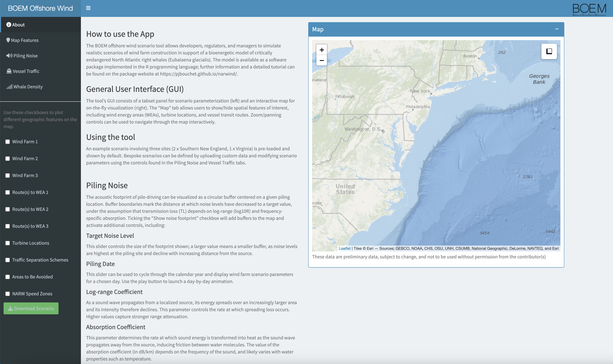
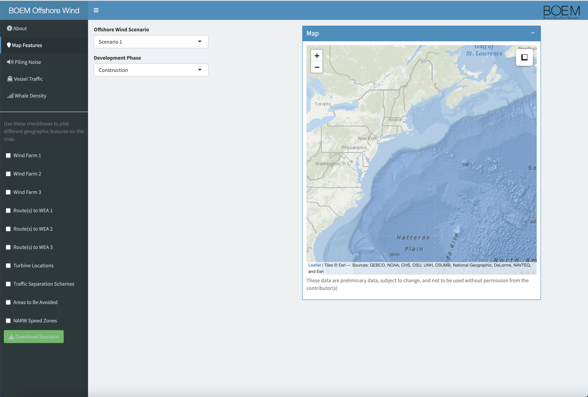

```{r setup, include = FALSE}
knitr::opts_knit$set(root.dir = rprojroot::find_rstudio_root_file())
knitr::opts_chunk$set(
  collapse = TRUE,
  comment = "#>")
```

```{r load_model, include=FALSE}
devtools::load_all()
```

```{r, echo = FALSE}
downloadthis::download_link(
  link = "https://raw.githubusercontent.com/offshore-wind/narwind/99df759f85ce0f5d495a864a5d35bc854b5951d9/vignettes/pdf/getting_started.pdf",
  button_label = "Download PDF",
  button_type = "primary",
  has_icon = TRUE,
  icon = "fa fa-file-pdf",
  self_contained = FALSE
)
```

## Preamble

This tutorial describes how to define custom offshore wind scenarios for use in the bioenergetic model. Preset scenarios co-developed with BOEM (for demonstration purposes) are also available.

## Example scenarios

The `narwind` package ships with three preset offshore wind scenarios, which summarize hypothetical phases of development at two sites off the Southern New England coast and a third off the Virginia coast (Figure 2.1).

Those sites were chosen as they represent two of the largest commercial offshore wind energy projects earmarked for development along the U.S. Atlantic seaboard in the next five years, and both overlap (or are in close proximity to) critical habitats for right whales, including the species’ migratory corridor (relevant to both Virginia and New England), as well as important feeding grounds such as Georges Bank and Nantucket Shoals (relevant to New England) (Figure 2.1). Additionally, each area is used by different cohorts of the population in different seasons, allowing for: (1) scenarios with asynchronous construction schedules to be considered, and (2) assessments of impacts at different stages of the NARW life cycle. To maintain consistency with previous studies, the Southern New England test case follows the specific wind farm scenarios defined in @Southall2021.

> **Note 2.1:** While realistic, these scenarios are not prescriptive and were designed only to demonstrate the benefits of adopting a bioenergetic modeling approach for conducting impact assessments on large baleen whales.

::: {style="width:850px"}

:::

> **Note 2.2:** Throughout this document, we refer to the R objects describing construction or operation activities as **scenarios**. Multiple scenarios (e.g., relating to successive phases of development spanning several years) together form a **scenario bundle**.

### Southern New England (SNE)

For consistency with existing risk assessment frameworks [@Southall2021], the SNE scenarios explore various patterns of installation, operation, and mitigation of two separate wind farms positioned within non-overlapping lease areas (Figure 2.2). These sites were identified following extensive consultations with BOEM, and with the intention to consider two developments that: (i) are similar but not identical to any current leases or proposed installation areas, (ii) lie at either end of the wind farm size spectrum for planned construction along the U.S. Atlantic seaboard, and (iii) are not adjacent to one another but are sufficiently close that their effects may be cumulative (Southall et al. 2021). Wind farm 1 is square in shape and covers an area of ca. 324 km 2 (18 x 18 km, approximately half the size of the corresponding site in (Southall et al. 2021), centered on (70.58°W, 40.81°N). This farm overlaps three lease areas (i.e., Beacon Wind OCS-A 0520, Mayflower Wind OCS-A 0521, and New England Wind OCS-A 0534), and represents a scenario slightly smaller than the largest existing or proposed offshore facilities currently being considered off the U.S. east coast. Wind farm 2 is rectangular in shape and covers an area of 200 km 2 (10 x 20 km), centered on (71.12°W, 41.15°N). This farm mainly overlaps one lease area (Revolution Wind, OCS-A 0486; marginal overlap with South Fork Wind, OCS-A 0517), and represents a scenario slightly larger than the smallest existing or proposed offshore facilities currently being considered off the U.S. east coast. A summary of the main characteristics of each wind farm is given in the accompanying project report.


To mimic realistic conditions, both wind farms are assumed to be developed using monopiles only. This includes a total of 100 monopiles in Farm 1 and 60 monopiles in Farm 2, following @Southall2021. In keeping with U.S. Coast Guard recommendations, farm installations are to be oriented according to a fixed grid design consisting of east-to-west rows and north-to-south columns with a one nautical mile (1.85 km) spacing (Figure 2.2). This uniform layout was adopted following extensive stakeholder consultation and provides adequate separation among individual turbines to alleviate hazards to navigation and allow for potential search and rescue operations. Installation is performed using hydraulic impact and/or vibratory pile driving by fleets of jack-up, anchored, or dynamic positioning vessels – along with necessary support and supply vessels. Typical pile driving operations are expected to take 1 to 4 hours.

### Virginia (VA)

Wind farm 3 is square in shape and covers an area of ca. 196 km 2 (14 x 14 km), centered on (75.41°W, 36.89°N). The boundary of the lease area is located approximately 45 km from the northwest corner of the Eastern Shore Peninsula and 50 km east of Virginia Beach, VA. This farm overlaps lease area OCS-A 0483, which is part of the commercial development phase of the Coastal Virginia Offshore Wind (CVOW) project (Figure 2.3). The pilot phase of the project was completed in 2020 with the installation of two 6 MW turbine generators in adjacent lease area OCS-A 0497.


A total of 90 monopiles are installed in Farm 3 under the proposed scenario. This is proportionally within the bounds of the CVOW project design envelope (n = 179–205, for a lease area twice the size of Farm 3). The preferred layout is a grid pattern oriented at 35 degrees to minimize wake losses within the wind farm. Turbines are expected to be placed approximately 0.75 nm (1.39 km) apart in an east-west direction and 0.93 nm (1.72 km) apart in a north-south direction. These distances may vary slightly during construction (subject to micro-siting); however, those variations are ignored for the purposes of scenario testing. This turbine layout has been designed to maximize power density in the lease area while minimizing costs to the rate payer under the Virginia Clean Economy Act and considering all existing uses of OCS-A 0483 and surrounding waters, including shipping traffic patterns, commercial and recreational fishing activities, marine safety, and impacts to biological and cultural resources.

### Timing of activities

Piling schedules vary between scenarios, as detailed below.

**Scenario 1 (Construction phase -- "unmitigated" case)**

This scenario entails the synchronous construction of all three wind farms at times coinciding with expected peaks in right whale abundance within each respective area (Jan--April in SNE, Jan--March in VA; Figure 2.4). The objective of this scenario is to explore the potential for cumulative effects of multiple installation activities under unmitigated conditions.

**Scenario 2 (Construction phase -- "mitigated" case)**

This scenario involves shutdowns of installation operations during the main right whale foraging/calving seasons (Nov--Apr). Construction resumes in May at the southward site (Farm 3) and during the late summer to early fall at sites 1 and 2 off New England (Figure 2.4). In addition, activities at each of the two SNE farms are asynchronous, with noise abatement systems in place to limit noise impacts. Note that a subset of only 60 monopiles are driven at Farm 1 in order to align with previous BOEM studies.

**Scenario 3 (Operation & maintenance)**

In this scenario, we assume that all three wind farms are in simultaneous and continuous operation (Figure 2.4). The primary footprint for operations is taken to be vessel traffic to and from wind farm sites; we do not consider vessel movements within farm areas.

::: {style="width:650px"}

:::

### Scenario objects in R

The parameters of all three preset scenarios are summarized in dedicated R objects (called `scenario_01`, `scenario_02`, and `scenario_03`). We can use the `str()` function in R (which stands for 'structure') to take a closer look at the contents of each scenario object. For example, here is an abridged representation of the structure of `scenario_01`:

```{r scenario_struct}
str(scenario_01,1)
```

The output above tells us that the `scenario_01` object comprises several elements:

-   `phase`: A numeric variable indicating the phase of development (`0` for baseline, `1` for construction, `2` for operations & maintenance).

-   `locs`: A table listing the coordinates of individual wind turbines for each wind farm site. Optionally, `locs` may also contain piling dates for each foundation.

-   `routes`: A spatial lines shapefile representing vessel routes to each wind farm site.

-   `vessels`: A table summarizing the nominal travel speed (in knots), fleet size, and numbers of round trips per foundation for each wind farm site, vessel route, and vessel class.

-   `start.month`: An integer vector indicating the month of construction start (1 = January, 12 = December) for each wind farm site. This is only relevant if piling dates are not provided in the `locs` table.

-   `start.day`: An integer vector indicating the day of construction start (1 = 1^st^, 15 = 15^th^) for each wind farm site. This is only relevant if piling dates are not provided in the `locs` table.

-   `piles.per.day`: An integer indicating the number of turbines being installed each day.

-   `ambient`: An integer defining the ambient noise level (in dB re 1µPa).

-   `sourceLvL`: An integer defining the source level (in dB re 1µPa) of the hammer strikes. This is assumed to correspond to the exact locations of the turbines, as listed in `locs`.

-   `lowerdB`: A numeric value defining the magnitude of noise attenuation (in dB re 1µPa) achieved when noise abatement systems are in place (e.g., bubble curtains).

-   `logrange`: A numeric value for the log-range coefficient used in the transmission loss model.

-   `absorb`: A numeric value for the absorption coefficient used in the transmission loss model.

The agent-based model uses scenario objects to define disturbance conditions in the simulations (see Tutorial 3).

## Custom scenarios

Users can modify the above parameters to generate bespoke scenarios for other wind farm sites of interest. This is achieved through an interactive, point-and-click Shiny app, which can be launched using the `scenario()` command. Using the assignment operator `<-`, we can save custom scenarios right from within the current R session by assigning them to R objects (e.g., `my_custom_scenario` in the example below) that can be passed to the agent-based model.

```{r app_launch, eval = FALSE}
my_custom_scenario <- scenario()
```

### App interface

The app consists of three main structural elements (Figure 2.5), namely:

-   A sidebar (left) – which is used for navigation, visualization, and scenario set up.

-   A text area (middle) – which displays information about the app, model parameters, and required user inputs.

-   An interactive map (right) – where scenario parameters and input layers can be visualized on the fly.



The map and sidebar always stay in place, however the contents of the main text area change dynamically in response to user selections.

The sidebar is split into a series of tabs (top) and tick boxes (bottom). Tabs give access to the app's features and with the exception of the Whale Density tab (which is only used for visualization purposes), allow users to modify scenario parameters. By contrast, tick boxes can only be used to toggle map layers on and off, i.e., they have no role in scenario building.

The map is interactive and can be zoomed (using either the +/- buttons in the top left or a scroll of the mouse), panned (by clicking and dragging). Distance measurements can also be taken by clicking on the ruler icon in the top right and following the on-screen instructions.

Designing a custom offshore wind scenario can be done in one of two ways:

-   By modifying one of the three preset scenarios available in the package

-   By crafting a scenario from scratch

We explain how to do this in the sections below.

### Scenario set up

First, start by clicking on the Scenario Set Up tab. The central text area will change to reveal several drop-down menus (Figure 2.6).

To adapt one of the pre-defined scenarios, choose either Scenario 1, Scenario 2, or Scenario 3 as appropriate. The parameters associated with the selected scenario will be populated throughout the rest of the app.

To define a custom scenario, choose Custom Scenario. Two new fields will appear, allowing turbine locations and vessel routes to be uploaded as separate files. An additional drop-down menu will also be available to indicate whether the custom scenario relates to construction or O&M activities. This is important, as it ensures that the scenario object is correctly labeled.



Turbine locations must be provided as a `.csv` file containing a minimum of three columns (Figure 2.7): a `windfarm` column with a unique integer ID number for each wind farm site, a `longitude` column, and a `latitude` column. Optionally (strongly recommended), a `date` column can be supplied to indicate when each pile is due to be installed. If the `date` column is not provided, the day and month of operation start for each site must be given.

{width="500"}

Similarly, vessel routes to each wind farm site must be provided as a `.shp` file of spatial line features, each with the following attributes: a `windfarm` ID (same as above) and a sequential `routeID` number (`1`, `2`, etc.) for each route associated with a particular farm.

### Piling noise

### Vessel traffic

### Whale density

### Download

Once all changes to scenario parameters have been made, the scenario object can be downloaded using the green Download Scenario button located on the left.

The `gantt()` function in R can be used to check that the timing of piling activities has been set up correctly in scenarios involving construction. For example:

```{r}
gantt(scenario_02)
```

## References
